# Autonomous Flight Intelligence Platform (AFIP)
## Engineering Diagram Package

**Classification:** Internal / Program Reference
**Notation:** Mermaid (primary), ASCII (where structural/layered notation is clearer)
**Derived Strictly From:** AFIP Product Specification v0.2, AFIP Software Architecture v0.1, First Principles: Information-Centric Architecture
**Scope Note:** Every node, object, enum value, and subsystem name below is taken verbatim from the uploaded specifications. No module, interface, or capability is introduced that is not already named in source material.

---

## 1. Overall AFIP Architecture

ASCII — layered structure per Software Architecture §2:

```
┌───────────────────────────────────────────────────────────┐
│  Layer E — Explainability & Record                         │
│  (renders explanation + permanent record; never feeds back  │
│   into a decision)                                          │
├───────────────────────────────────────────────────────────┤
│  Layer D — Decision & Arbitration                            │
│  (proposes intent; independently checks intent before        │
│   it may proceed; fail-closed)                                │
├───────────────────────────────────────────────────────────┤
│  Layer C — Situational Reasoning                              │
│  (health / navigation / mission judgment, cross-domain        │
│   reasoning)                                                  │
├───────────────────────────────────────────────────────────┤
│  Layer B — Belief Formation                                   │
│  (reconciles evidence into confidence-scored understanding)   │
├───────────────────────────────────────────────────────────┤
│  Layer A — Evidence Intake                                    │
│  (receives whatever simulator/aircraft exposes; no             │
│   interpretation)                                              │
└───────────────────────────────────────────────────────────┘
        ▲ evidence flows up            authority flows down ▼
┌───────────────────────────────────────────────────────────┐
│  Flight Simulator (source of physical truth) — outside AFIP  │
│  Flight Control Layer (PX4/ArduPilot-class) — outside AFIP    │
└───────────────────────────────────────────────────────────┘
```

Mermaid equivalent:

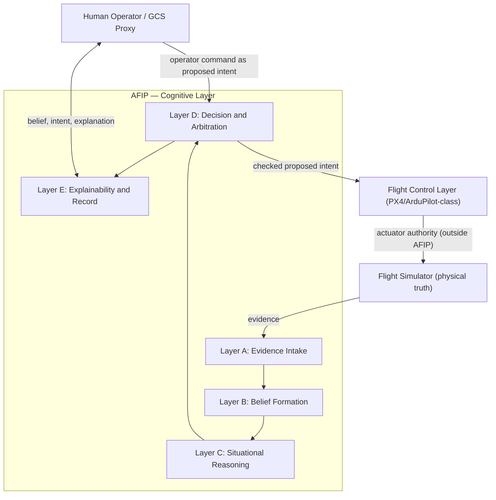

**No-skip rule (Software Architecture §2):** a layer exchanges information only with the layer immediately adjacent to it. Layer D never acts on Layer A's raw evidence; Layer B never issues anything to the flight-control boundary.

---

## 2. Data Flow Diagram

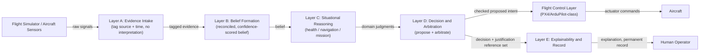

This traces directly to Product Spec §6.5 ("nothing is understood until raw signals have been reconciled") and the evidence/belief/decision separation that Software Architecture §0 establishes as never permitted to collapse into one structure.

---

## 3. Event Flow Diagram

Event-driven triggers, per subsystem, as documented in the Software Architecture's Information Flow Topology:

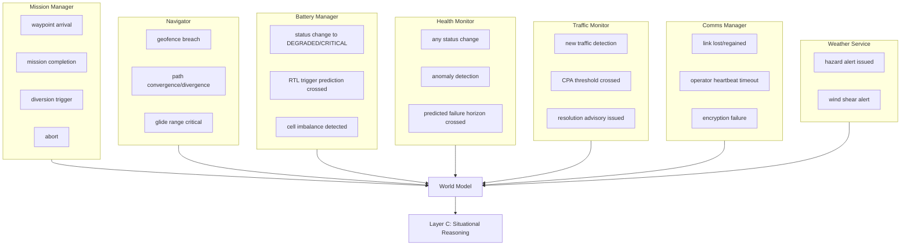

Continuous (non-event-driven) channels documented alongside these events: AircraftState pose/velocity at 100–400 Hz, BatteryState voltage/current/SoC at 10 Hz, WeatherState wind at 1 Hz, MissionState progress at 10 Hz, TrafficState cooperative tracks at 1 Hz / non-cooperative at 10–20 Hz.

---

## 4. Module Dependency Graph

Per the Information Flow Topology tables (Software Architecture, "Information Flow Topology" section):

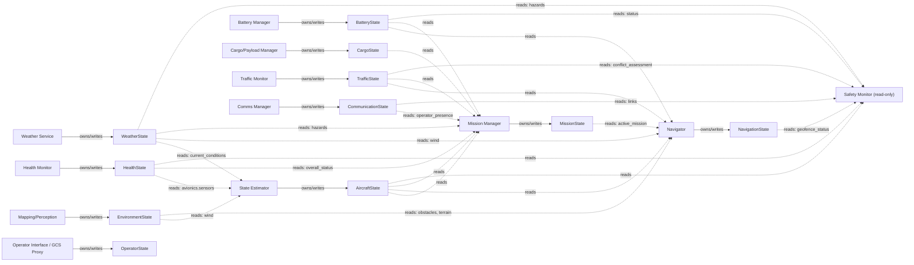

**Special case — Safety Monitor:** owns no World Model object; it is a consumer-only guardian that commands the flight-control layer (PX4) directly through a separate emergency channel, never through the World Model.

**Special case — Health Monitor:** the only subsystem that reads ALL other World Model objects, plus raw sensor streams directly from drivers, to detect cross-object inconsistencies (e.g., AircraftState reports motion while GPS reports stationary).

---

## 5. World State Hierarchy

```mermaid
flowchart TD
    WM["World Model\n(shared, temporally coherent, confidence-scored state)"]
    WM --> AS["AircraftState\nowner: State Estimator"]
    WM --> MS["MissionState\nowner: Mission Manager"]
    WM --> ES["EnvironmentState\nowner: Mapping/Perception"]
    WM --> NS["NavigationState\nowner: Navigator"]
    WM --> BS["BatteryState\nowner: Battery Manager"]
    WM --> HS["HealthState\nowner: Health Monitor"]
    WM --> CS["CargoState\nowner: Cargo/Payload Manager"]
    WM --> TS["TrafficState\nowner: Traffic Monitor"]
    WM --> COMS["CommunicationState\nowner: Comms Manager"]
    WM --> WS["WeatherState\nowner: Weather Service"]
    WM --> OS["OperatorState\nowner: Operator Interface / GCS Proxy"]

    AS --> AS1["pose, velocity, acceleration"]
    AS --> AS2["dynamic_mode, flight_phase"]
    AS --> AS3["state_history_ringbuffer (immutable)"]

    MS --> MS1["active_mission.waypoints[]"]
    MS --> MS2["progress, divergence"]
    MS --> MS3["mission_log (immutable)"]

    HS --> HS1["subsystems: propulsion, avionics, communication, payload"]
    HS --> HS2["anomalies.active[] / history[] (immutable)"]
    HS --> HS3["prognostics"]
```

**Rule of one writer (First Principles document):** every object has exactly one authorized writer. Multiple writers to the same field would produce race conditions and undefined behavior.

---

## 6. Mission Lifecycle State Machine

Built from the literal enums documented in `AircraftState.flight_phase`, `AircraftState.dynamic_mode`, and `MissionState.status`:

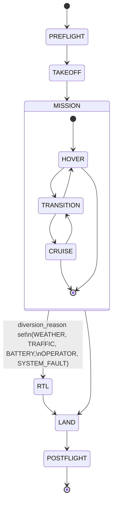

MissionState.status enum, tracked in parallel with flight_phase:

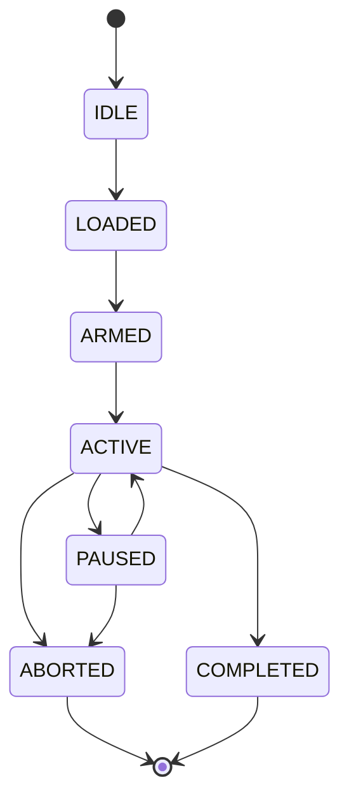

**Divergence is a documented field, not an inferred state:** `MissionState.divergence.is_diverted`, `.diversion_reason` (WEATHER, TRAFFIC, BATTERY, OPERATOR, SYSTEM_FAULT), and `.original_mission_id` are the only documented mechanism for re-routing away from the committed mission plan.

---

## 7. Decision Pipeline

Per Software Architecture §5 (decision structure, strict evaluation order) and §6 (certainty/advisory boundary):

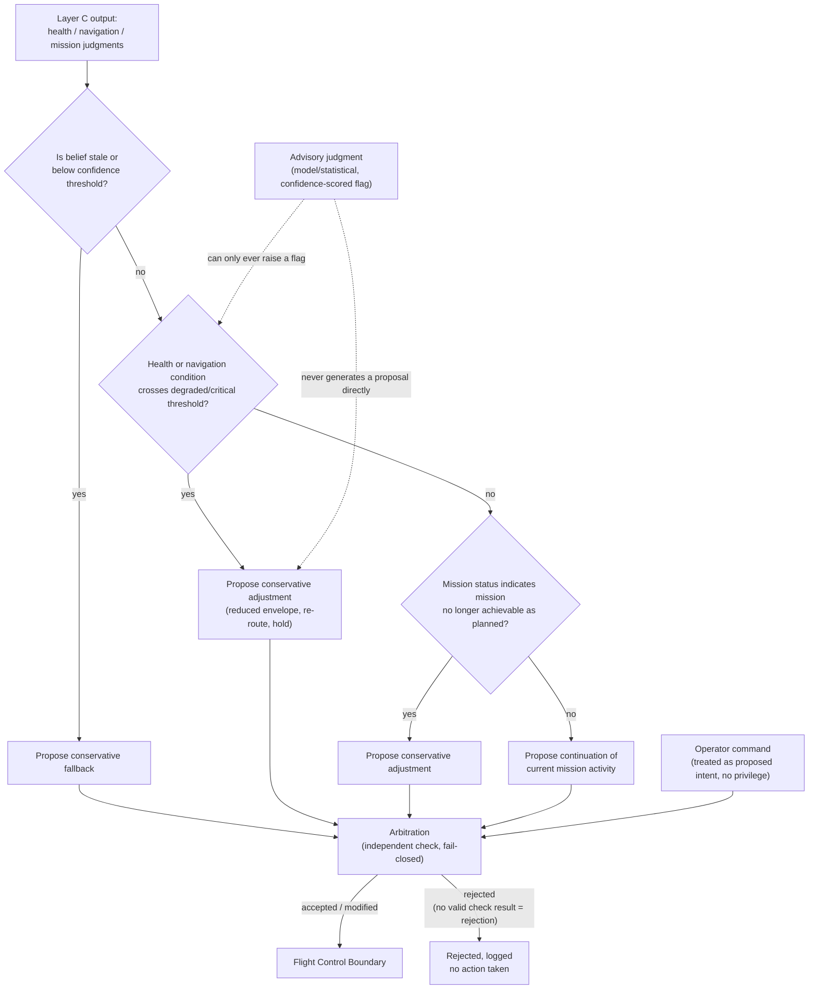

This ordering guarantees a mission-status concern can never outrank a health/navigation-critical condition, and that stale or low-confidence belief is always addressed before any other judgment is trusted (Product Spec §9.7, §9.12).

---

## 8. Explainability Pipeline

Per Software Architecture §1 (P6) and the Layer E description:

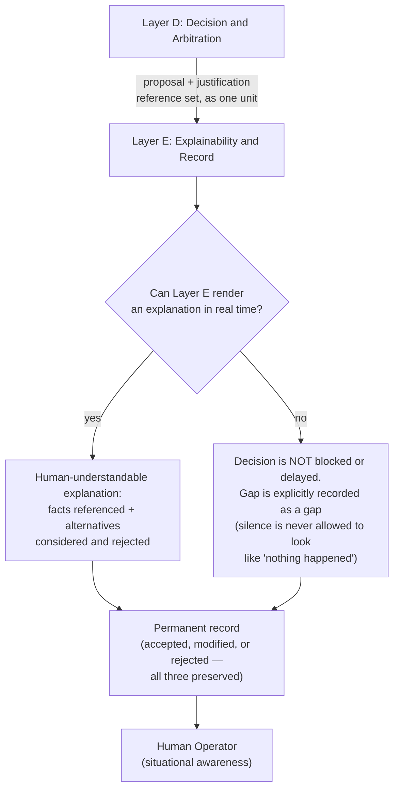

**Invariant (P6, Architectural Invariant 6):** the justification is not generated afterward by Layer E — Layer E only renders what Layer D already produced as part of deciding. Explanation is never a reconstruction.

---

## 9. Health Monitoring Flow

Per the HealthState specification and the Health Monitor's documented ownership/consumer relationships:

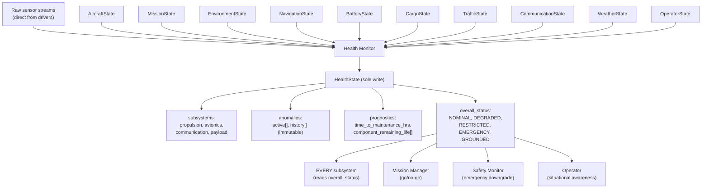

**Cross-consistency check documented for Health Monitor:** it looks for inconsistencies such as AircraftState reporting motion while GPS reports stationary — the only subsystem architecturally permitted to read every World Model object for this purpose.

---

## 10. Risk Assessment Flow

Product Spec §9.6 requires AFIP to "continuously assess whether the mission is on track, at risk, or no longer achievable as planned" — this is the literal source language for risk classification, evaluated inside Layer C (Situational Reasoning) using the certainty/advisory boundary from Software Architecture §6:

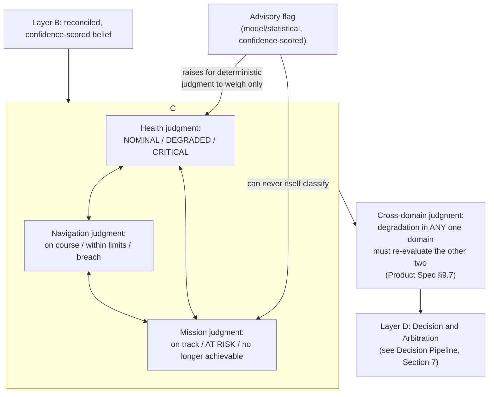

**Invariant governing this flow:** an advisory flag can never, by itself, cause a proposed intent to be generated (Software Architecture §6, Architectural Invariant 4) — it can only ever raise something for deterministic judgment in Layer C to weigh before the classification reaches Layer D.

---

*AFIP Program Office — Engineering Diagram Package. All node names, enum values, and subsystem labels are sourced verbatim from the Product Specification, Software Architecture Document, and First Principles: Information-Centric Architecture. No module, interface, or diagram element beyond those documented sources has been introduced.*
