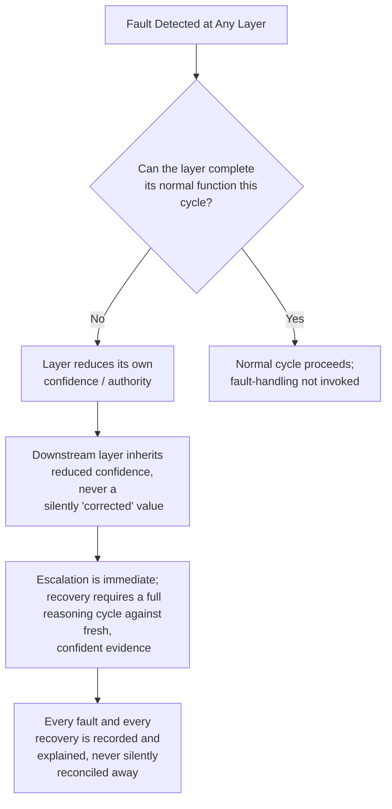

# Autonomous Flight Intelligence Platform (AFIP)
## Failure Mode and Recovery Matrix

**Document ID:** AFIP-SE-006
**Document Type:** Systems Engineering — Failure Mode and Recovery Matrix
**Status:** Draft v0.1
**Derived From:** AFIP Product Specification v0.2; AFIP Software Architecture v0.1; AFIP World State Engine v0.1; AFIP Mission Executive v0.1; AFIP Navigation System v0.1; AFIP Health Monitoring System v0.1; AFIP Explainability Engine v0.1
**Related Documents:** AFIP-SE-001 through AFIP-SE-005
**Baseline vs. Implementation:** Every failure mode and recovery behavior below is sourced from the baseline architecture's own fault-handling sections. No new failure mode is introduced. Where the current implementation phase realizes a recovery mechanism under different working names, this is marked with a labeled **Implementation Note**.
**Scope of this document:** A single, per-layer FMEA-style matrix covering every failure mode AFIP's own documents anticipate, its detection mechanism, its systemic effect, its governing recovery/response rule, and the module responsible for that response.

---

## 1. Purpose

AFIP-SE-002 §6 introduced a cross-system fault summary table. This document expands that summary into a full Failure Mode and Recovery Matrix — the single reference for "if X breaks, what happens, and who is responsible for the response." The governing rule stated once in AFIP-SE-002 §6 applies to every row below without exception: **a failure anywhere in AFIP results in AFIP asking for less trust, never in AFIP acting harder to compensate** (Architecture §7).

---

## 2. Failure Mode Matrix — Layer A (Evidence Intake)

| Failure Mode | Detection Mechanism | System Effect | Recovery / Response | Responsible Module | Traceability |
|---|---|---|---|---|---|
| Expected evidence source stops delivering | WSE observes absence of expected update for a source | Affected Belief Field's confidence is reduced, not silently held at last value | WSE marks the field reduced-confidence; downstream layers inherit this immediately | World State Engine | WSE §7 row A; Architecture §7 row A |
| Malformed/corrupted raw signal | Evidence Intake tags source+time only; malformed content is not corrected here | Evidence Record still delivered; correctness judgment deferred | Reconciliation at WSE treats it as one more (possibly disagreeing) source | Evidence Intake (pass-through only) | Architecture §3.1 |
| Simulator-side signal outage (source-external) | Same as row 1 | Same as row 1 | AFIP asserts no authority over the source itself; it only adjusts its own trust in the resulting belief | World State Engine | Architecture §3.1; Product Spec §10 |

---

## 3. Failure Mode Matrix — Layer B (World State Engine)

| Failure Mode | Detection Mechanism | System Effect | Recovery / Response | Responsible Module | Traceability |
|---|---|---|---|---|---|
| Conflicting evidence from two or more sources for the same fact | WSE reconciliation logic compares sources every cycle | Confidence reduced; the conflict itself is preserved in the Reconciliation Record, never averaged away | Field is retained at reduced confidence; conflict is logged, not resolved by preference | World State Engine | WSE §7 row 2 |
| Insufficient evidence to reconcile a field at all | WSE reconciliation cannot produce a value with any confidence | Field is marked unknown/low-confidence — never omitted from the Snapshot | Field explicitly flagged unknown; downstream conservative fallback triggered at the consuming layer | World State Engine | WSE §7 row 3 |
| Reconciliation cycle cannot complete | Internal WSE fault (timing, resource, or logic fault) | No new Snapshot is published for that cycle | Layer C continues reasoning against the last valid (aging) Snapshot, whose age is itself visible | World State Engine | WSE §7 row 4; Architecture §7 row B |
| Snapshot published in a partially-updated state | Atomicity discipline (double-buffering/RCU-equivalent) prevents this by design | N/A — architecturally excluded, not merely mitigated | Entire Snapshot swaps atomically; readers never see mixed old/new sub-objects | World State Engine | WSE §3.6, §8 |

---

## 4. Failure Mode Matrix — Layer C (Situational Reasoning: Mission Executive, Health Monitoring System)

| Failure Mode | Detection Mechanism | System Effect | Recovery / Response | Responsible Module | Traceability |
|---|---|---|---|---|---|
| Belief confidence too low to support a domain judgment | Domain's confidence floor check (ME §7.4; HMS §7.4) | Domain marked unknown rather than given an optimistic default | Conservative fallback in precedence evaluation (ME §2 step 1) | Mission Executive | Architecture §7 row C; ME §7.4 |
| HMS aggregation cannot complete a cycle | HMS's own health-score computation faults | No health score is asserted for that cycle | HMS reports "health unknown" rather than a stale score presented as current | Health Monitoring System | HMS §10.5 |
| Two or more Critical conditions concurrent | HMS ceiling rule evaluation | Overall Health forced to critical regardless of weighted composite score | Classification escalated to Emergency tier; justification explicitly names the concurrent conditions | Health Monitoring System | HMS §9, §7.1 |
| Mission Executive proposal function faults mid-cycle | Internal ME fault (cannot complete Decision Flow) | No normally-reasoned proposal is generated | Executive Posture → SUSPENDED; single pre-defined minimal safe proposal substituted, still fully arbitrated | Mission Executive | ME §6.2; Architecture §7 row D |
| Cross-domain compounded condition (near-threshold in two+ domains) | ME risk assessment evaluates domains jointly, not just individually | Risk indicated may exceed either domain's individual threshold | Precedence evaluation weighs the compounded condition, not just isolated per-domain scores | Mission Executive | ME §5.3 |

**Implementation Note.** Where the current implementation phase labels HMS's deterministic failure-projection function the "Prediction Engine" and ME's cross-domain risk logic the "Risk Engine" (per AFIP-SE-002 §3.3–§3.4), the failure modes and recovery behaviors above are unchanged — both remain internal functions of HMS and ME respectively, not independently-faulting modules with their own recovery paths.

---

## 5. Failure Mode Matrix — Layer D (Decision & Arbitration)

| Failure Mode | Detection Mechanism | System Effect | Recovery / Response | Responsible Module | Traceability |
|---|---|---|---|---|---|
| Arbitration cannot produce a valid check result | Absence of a definitive Accept/Modify/Reject outcome | Proposal has no confirmed disposition | Treated as **Rejected by default** — fail-closed; never interpreted as implicit approval | Arbitration | Architecture Invariant 3 |
| Proposal source (ME or Operator) attempts to bypass Arbitration | Architectural — no such path exists in the design | N/A — excluded by construction, not merely detected | Every proposal, regardless of source or urgency, is routed through the identical check | Arbitration | Architecture Invariant 2; ME §6.4 |
| Rejected proposal not recorded | Would be a documentation/logging fault, not a decision fault | Loss of audit trail for a rejection | A rejected outcome is recorded and explained with equal weight to an accepted one — never silently dropped | Explainability & Record | Architecture §4 flow rule 3 |

---

## 6. Failure Mode Matrix — Navigation System

| Failure Mode | Detection Mechanism | System Effect | Recovery / Response | Responsible Module | Traceability |
|---|---|---|---|---|---|
| Internal NS fault, planning cycle cannot complete | NS self-monitoring of its own planning loop | No new Desired Route/setpoints computed | Holds last known-good Desired Route and setpoints; reports fault as a Route Status condition | Navigation System | NS §10 |
| Accepted Intent channel (Arbitration → NS) lost | Communication timeout on this channel | NS loses new strategic guidance | Continues executing the last Accepted Intent (or holds, if that was the last instruction); reports comm loss as fact; never invents new strategic intent | Navigation System | NS §10 |
| Newly detected obstacle (unknown, within look-ahead horizon) | Obstacle Avoidance function classification | Existing route may no longer be valid | Bounded local maneuver applied first; if insufficient, Dynamic Rerouting invoked | Navigation System | NS §8 |
| Route to current target found infeasible | Dynamic Rerouting exhausts feasible paths | Current target cannot be reached as planned | Reported upward as fact (Route Status = unreachable); Mission Executive's achievability judgment decides next action — NS does not substitute a new destination on its own authority | Navigation System | NS §8 resolution step 3; ME §8.1 |
| Position/GPS confidence degrades | Fixed freshness rule applied to positioning source | Guidance quality uncertain | Confidence-tagged fact reported upward through Evidence Intake, same discipline as any other evidence | Navigation System | NS §10 |

---

## 7. Failure Mode Matrix — Layer E (Explainability & Record)

| Failure Mode | Detection Mechanism | System Effect | Recovery / Response | Responsible Module | Traceability |
|---|---|---|---|---|---|
| A pipeline stage cannot complete (e.g., SUSPENDED-posture minimal safe proposal has no normal justification) | XE Stage 9 gap-detection | Explanation would otherwise be incomplete or fabricated | The gap itself is rendered as the explanation — never filled with invented reasoning | Explainability Engine | XE §5 Stage 9 |
| Explanation cannot be rendered in real time | Internal XE timing/resource fault | Operator-facing explanation delayed or unavailable for that cycle | The underlying decision proceeds unaffected — explanation delay never blocks or delays the decision itself | Explainability Engine | Architecture §7 row E; XE §2 item 9 |
| Alert tier under-classified relative to actual proposal/outcome severity | Structural rule: alert priority derives deterministically from proposal category and Arbitration outcome, never from a discretionary judgment | Would risk under-alerting a Critical/Emergency condition | Excluded by design — a qualifying Critical/Emergency condition is never displayed at a lower priority | Explainability Engine | XE §8, two structural rules |

**Implementation Note.** Where the current implementation phase surfaces XE's anchoring function as "Mission Timeline" (per AFIP-SE-002 §3.8), a failure to anchor an explanation to its Snapshot version/Mission Phase State is treated identically to any other XE pipeline-stage failure above — recorded as a gap, never silently omitted.

---

## 8. Cross-Layer Recovery Discipline

Restated as a single governing rule set, applicable to every matrix above:

This single flow applies identically whether the fault originates in Evidence Intake, the WSE, HMS, the Mission Executive, Arbitration, the Navigation System, or the Explainability Engine — no layer's fault-handling path is exempt from recording, and no layer is permitted to treat the absence of new bad evidence as confirmation that a fault has cleared (Mission Executive §7.5; HMS §9).

---

## 9. Traceability and Open Items

Every failure mode above is sourced to its parent document's own fault-handling section. This document introduces no new failure mode, no new detection mechanism, and no new recovery rule. The two open items carried from AFIP-SE-004 §6 (ASCENT/APPROACH-DESCENT fault classification; SUSPENDED recovery target posture) remain open and are not resolved here, since they concern classification of an existing rule, not a new failure mode.

---

**End of Document 6 — Failure Mode and Recovery Matrix**
