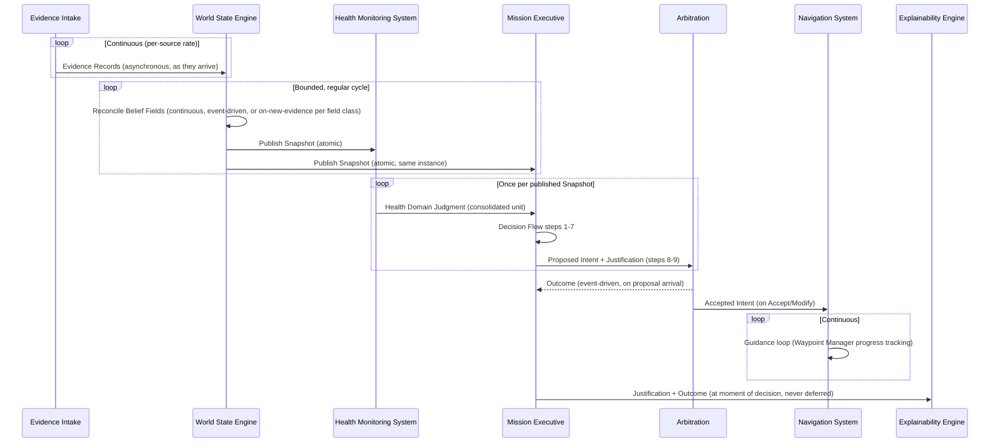

# Autonomous Flight Intelligence Platform (AFIP)
## Timing & Update Frequency Specification

**Document ID:** AFIP-SE-007
**Document Type:** Systems Engineering — Timing Specification
**Status:** Draft v0.1
**Derived From:** AFIP World State Engine v0.1; AFIP Mission Executive v0.1; AFIP Navigation System v0.1; AFIP Health Monitoring System v0.1; AFIP Explainability Engine v0.1; AFIP Software Architecture v0.1
**Related Documents:** AFIP-SE-001 (Data Flow §8), AFIP-SE-002 (Event Flow), AFIP-SE-004 (State Machine Specification)
**Baseline vs. Implementation:** All cadences below are drawn from the relative/qualitative timing rules stated in the baseline documents (e.g., "continuous," "event-driven," "a bounded, regular cycle"). None of the source documents assert a specific numeric rate (Hz) or latency budget — this is intentional, consistent with the Product Specification's exclusion of implementation detail (Product Spec §10). Any specific numeric value adopted by the current implementation phase is recorded as an **Implementation Note** and is never treated as a baseline requirement.
**Scope of this document:** Consolidates every timing and cadence rule scattered across the source documents into one authoritative reference, and states the *reasoning* behind each rate class, not merely the rate class itself.

---

## 1. Purpose

Earlier documents (AFIP-SE-001 §8; AFIP-SE-004; AFIP-SE-005) each stated timing rules relevant to their own scope. This document is the single place a reviewer can check "how often does X update, and why" without cross-referencing every prior document.

---

## 2. Governing Timing Principle

Two axes govern every timing decision in AFIP, restated from the Information-Centric Architecture reference and the WSE document:

1. **Data is either continuous or event-driven — never ambiguously both** (WSE §5.2). A field's classification on this axis is fixed by its physical nature, not by implementation convenience.
2. **Snapshot publication cadence is deliberately decoupled from internal reconciliation cadence** (WSE §5.1) — Layer C must never observe a half-reconciled world, so the WSE publishes on a bounded, regular cycle distinct from (and no faster than) its fastest internal per-field update rate.

---

## 3. Belief-Field Update Cadence (World State Engine)

| Belief Field Category | Update Model | Rationale | Source |
|---|---|---|---|
| Kinematic/Pose | Continuous, essentially every reconciliation cycle | Navigation judgment and control-adjacent decisions depend on currency above all else | WSE §5.2 |
| Propulsion/Actuation, Power/Energy | Continuous, high rate, slightly lower than Kinematic/Pose | Reflects the natural rate of physical change in these systems | WSE §5.2 |
| Payload, Subsystem Health | Event-driven (attach/detach, sensor state change) | These change discretely, not continuously — resampling them on a clock would manufacture false precision | WSE §5.2 |
| Environment State (general) | Lower rate than Aircraft State, except specific fast-changing sources | Slower-varying by nature, except where a specific sensor (e.g., an obstacle sensor) demands faster attention | WSE §5.2 |
| Mission Definition | On new evidence only (new/amended assignment) | Not resampled on any clock — it only changes when someone changes it | WSE §5.2 |
| Mission Progress | Recomputed every time relevant Aircraft State changes | Keeps progress always consistent with the Snapshot it is drawn from, never independently stale | WSE §5.2 |

---

## 4. Snapshot and Reasoning Cycle Cadence

| Interface / Cycle | Cadence Rule | Rationale | Source |
|---|---|---|---|
| WSE Snapshot publication | Bounded, regular cycle; not on every individual reconciliation | Prevents Layer C from observing a half-reconciled world mid-cycle | WSE §5.1 |
| Mission Executive reasoning cycle | One complete Decision Flow (ME §2, steps 1–10) per published Snapshot | Ensures every proposal is grounded in one specific, versioned Snapshot, never a blend of two | ME §2 |
| HMS aggregation cycle | Refreshed every reasoning cycle, as one consolidated unit (never partially updated) | Mirrors Snapshot atomicity discipline so ME never reads a half-formed health picture | HMS §6.7 |
| Arbitration check | Once per Proposed Intent received (event-driven on proposal arrival, not polled on a clock) | A check is only meaningful against a specific proposal, not against elapsed time | Architecture §3.4 |
| Navigation System guidance loop | Continuous, driven by Waypoint Manager's ongoing progress tracking | Guidance setpoints must track the aircraft's continuously-changing position | NS §5 |
| Explainability Engine rendering | At the moment each decision is made — never deferred or batched | A reconstructed-after-the-fact explanation would not reflect the actual reasoning state at decision time | Architecture P6; XE §2 item 2 |

---

## 5. Cadence Flow Diagram

---

## 6. Escalation and Recovery Timing

Restated from AFIP-SE-002 §4 and AFIP-SE-004 §3, as a timing-specific rule:

| Direction | Timing Rule | Source |
|---|---|---|
| Escalation (posture downgrade, alert tier increase, domain classification worsening) | Immediate — takes effect the same cycle the qualifying condition is detected | Mission Executive §1.2; HMS §9 |
| Recovery (posture upgrade, alert tier decrease, domain classification improving) | Requires a full reasoning cycle confirming the condition has cleared against a **fresh, confident** Snapshot | Mission Executive §1.2, §7.5; HMS §9 |
| Confidence recovery in general | Never assumed from mere absence of new bad evidence — requires active, fresh, confirming evidence | Mission Executive §7.5; XE §6.6 |

This asymmetry — fast down, slow and evidence-gated up — is deliberate and applies uniformly across every escalatable state in AFIP (Executive Posture, HMS Alert Tier, domain classifications).

---

## 7. Latency and Real-Time Bounds — Open Items

The source documents intentionally do not specify:

- A numeric maximum end-to-end latency from evidence arrival to Accepted Intent delivery.
- A numeric Snapshot publication rate (Hz).
- A numeric bound on how long Arbitration may take to return an outcome before being treated as "cannot produce a valid result" (Architecture Invariant 3 describes the *behavior* on non-production of a result, not a timeout value).

These are flagged as **open items** consistent with the practice established in the source documents' own "Open Items" sections (WSE, Mission Executive, HMS) — this document does not assign numeric values not present in the baseline.

**Implementation Note.** Where the current implementation phase adopts specific numeric rates or timeout values for any of the above (e.g., a fixed Snapshot publication rate or an Arbitration timeout), those values are implementation parameters, not baseline requirements, and should be recorded in the implementation's own configuration reference rather than in this document, to avoid this ICD-adjacent specification silently becoming a de facto (and possibly premature) real-time requirement.

---

## 8. Traceability Notes

Every cadence rule above is sourced to a specific section of its parent document. No numeric rate is asserted anywhere in this document except where explicitly marked as an Implementation Note, and no such note is treated as binding on the baseline architecture.

---

**End of Document 7 — Timing & Update Frequency Specification**
