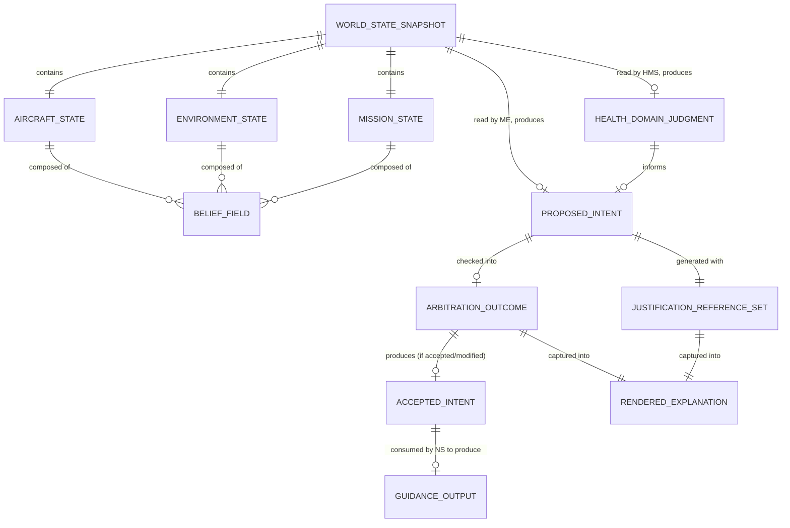

# Autonomous Flight Intelligence Platform (AFIP)
## Data Dictionary & World State Reference

**Document ID:** AFIP-SE-008
**Document Type:** Systems Engineering — Data Dictionary
**Status:** Draft v0.1
**Derived From:** AFIP World State Engine v0.1; AFIP Mission Executive v0.1; AFIP Navigation System v0.1; AFIP Health Monitoring System v0.1; AFIP Explainability Engine v0.1
**Related Documents:** AFIP-SE-001 (Data Flow), AFIP-SE-003 (ICD), AFIP-SE-006 (Failure Mode Matrix)
**Baseline vs. Implementation:** Every object and field described here is conceptual, not a wire schema — consistent with every source document's explicit exclusion of implementation-level data structures. No field is invented; every entry traces to a specific section of its owning system's document.
**Scope of this document:** A single reference dictionary for every data object that exists anywhere in AFIP, organized by owning layer, with definition, sub-structure, owner, and consumers.

---

## 1. Purpose

This is the "what does each object actually contain" reference. AFIP-SE-001 established *who* produces and consumes each object; AFIP-SE-003 established the *interface contract* each object crosses; this document defines *what is inside* each object at the conceptual level the baseline specifies.

---

## 2. Belief Field — The Universal Unit of World State Engine Output

Every fact the WSE holds is expressed as a **Belief Field**, never as a bare value (WSE §3.2). This structure is universal across every Aircraft State, Environment State, and Mission State element below.

| Component | Definition | Source |
|---|---|---|
| **Value** | The reconciled fact itself (e.g., current altitude) | WSE §3.2 |
| **Confidence** | A measure of how much the WSE trusts this value, derived from source agreement, recency, and conflict history | WSE §3.2 |
| **Freshness** | How recently this value was updated, governing whether it is still considered valid | WSE §3.2 |
| **Provenance** | Which evidence source(s) contributed to this value | WSE §3.2 |

No consumer of a Belief Field is ever given the Value without its accompanying Confidence, Freshness, and Provenance — the four are inseparable (WSE §3.2, §6).

---

## 3. World State Engine Objects

### 3.1 Aircraft State

Definition: the WSE's reconciled belief about the aircraft's own kinematic and internal condition (WSE §3.3).

| Sub-Grouping | Contents (Conceptual) | Source |
|---|---|---|
| Kinematic/Pose | Position, attitude, velocity, and — specific to this tilt-rotor airframe — nacelle angle, used to recognize hover/transition/cruise configuration | WSE §3.3 |
| Propulsion/Actuation | Motor/ESC state, actuator positions, propulsion system status | WSE §3.3 |
| Power/Energy | Battery/power state, consumption trend, remaining-energy estimate | WSE §3.3 |
| Payload | Current payload state and configuration | WSE §3.3 |
| Subsystem Health | Raw per-subsystem health indicators feeding the Health Monitoring System's own scoring | WSE §3.3 |

### 3.2 Environment State

Definition: the WSE's reconciled belief about the world around the aircraft (WSE §3.4).

| Sub-Grouping | Contents (Conceptual) | Source |
|---|---|---|
| Atmospheric | Wind, weather conditions relevant to airframe loading and thermal margin | WSE §3.4 |
| Obstacle/Traffic | Known and newly-detected obstacles, traffic tracks | WSE §3.4 |
| Geofence | Boundary constraints applicable to the current mission | WSE §3.4 |
| Candidate Sites | Ranked alternate landing/diversion sites, continuously refreshed (fed by Navigation System facts re-entering as evidence) | WSE §3.4; NS §9 |

### 3.3 Mission State

Definition: the WSE's reconciled belief about what the mission is and how it is progressing (WSE §3.5).

| Sub-Grouping | Contents (Conceptual) | Source |
|---|---|---|
| Mission Definition | The assigned mission itself — target, constraints, objective — updated only on new/amended assignment evidence | WSE §3.5 |
| Mission Progress | Recomputed belief of progress against the Mission Definition, refreshed whenever relevant Aircraft State changes | WSE §3.5 |

### 3.4 World State Snapshot

Definition: the single, atomic, versioned publication combining one current instance each of Aircraft State, Environment State, and Mission State (WSE §3.6). This is the only WSE output any Layer C system is permitted to read; no sub-object is ever exposed individually (WSE §6, §8).

| Field | Definition | Source |
|---|---|---|
| Version marker | Identifies this specific Snapshot instance, used by XE for anchoring explanations (XE §9) | WSE §3.6 |
| Timestamp | When this Snapshot was published | WSE §3.6 |
| Aircraft State (current) | See 3.1 | WSE §3.6 |
| Environment State (current) | See 3.2 | WSE §3.6 |
| Mission State (current) | See 3.3 | WSE §3.6 |

### 3.5 Reconciliation Record

Definition: an append-only account of how each published Snapshot came to hold the values it held (WSE §3.7). Flows one-way, out of the WSE, into Layer E only — never read back by the WSE, Mission Executive, or HMS (WSE §3.7, §8).

| Field | Definition | Source |
|---|---|---|
| Reconciled Evidence References | Which Evidence Records were reconciled into this cycle's Belief Fields | WSE §3.7 |
| Agreement/Conflict Record | Where sources agreed or conflicted, preserved rather than resolved by preference | WSE §3.7 |
| Confidence/Freshness Derivation | How confidence and freshness were arrived at for each affected Belief Field | WSE §3.7 |

---

## 4. Health Monitoring System Objects

Definition: the single consolidated unit HMS hands to the Mission Executive each cycle (HMS §10.1).

| Field | Definition | Source |
|---|---|---|
| Overall Health classification | Nominal / Degraded / Critical | HMS §9, §10.1 |
| Health Score | Weighted composite across sub-domains, subject to the ceiling rule (concurrent Critical conditions force Emergency-tier classification regardless of the weighted number) | HMS §7.1, §10.1 |
| Justification Reference Set | The specific sub-scores and Belief Fields that produced the classification | HMS §10.1 |
| Warnings | Sub-threshold conditions worth surfacing but not yet Critical | HMS §5, §9 |
| Predicted Failures | Deterministic, model-based projections: subsystem, model/threshold, projected time/distance-to-threshold, confidence — never a bare, unexplained prediction | HMS §8.7 |
| Recommended Actions | Confidence-tagged advisory suggestions, carrying no authority of their own | HMS §5 |
| Mission Readiness | Ready / Ready with Constraints / Not Ready — consulted specifically during PRE-MISSION VALIDATION | HMS §5, §6.6 |

**Sub-domain weighting (Health Score composite), as specified:**

| Sub-Domain | Weight | Rationale | Source |
|---|---|---|---|
| Motors/ESCs | 25% | Highest thermal load during hover/transition | HMS §7.2, §6.2 |
| Battery/Power | 30% | Highest energy consumption during cruise, this airframe's known profile | HMS §7.2 |
| (Remaining sub-domains) | Remainder | Distributed per HMS §7.2's full weighting scheme (not re-derived here beyond the two dominant weights already cited in Documents 1–5) | HMS §7.2 |

**Implementation Note.** Where the current implementation phase labels the six deterministic projection models (battery depletion, motor overheating, communication degradation, GPS degradation, high wind risk, sensor inconsistency) collectively the "Prediction Engine" (AFIP-SE-002 §3.4), each model's output is exactly one Predicted Failure entry in the structure above (HMS §8.1–§8.7) — no additional field is introduced by this naming.

---

## 5. Mission Executive Objects

### 5.1 Internal Continuity State (Not a Belief)

| Field | Definition | Source |
|---|---|---|
| Active Intent Register | The most recently Arbitration-accepted (unmodified or modified) intent | Mission Executive §3.2 |
| Last-Cycle Outcome | Accept / Modify / Reject from the previous Arbitration cycle | Mission Executive §3.2, §2 step 10 |
| Mission Phase State | Current recognized phase (AFIP-SE-004 §2) — a read, not a decision | Mission Executive §1.1 |
| Executive Posture | Current trust level (AFIP-SE-004 §3) — Nominal / Cautious / Minimal / Suspended | Mission Executive §1.2 |

Explicitly not a Belief Field — carries no Confidence/Freshness/Provenance of its own (Mission Executive §3.2; Architecture P4).

### 5.2 Proposed Intent + Justification Reference Set

| Field | Definition | Source |
|---|---|---|
| Proposed Intent category | One of: Continue, Adjust, Hold, Divert, Abort/Return-to-Base | Mission Executive §4.1 |
| Justification Reference Set | The specific Belief Fields, classifications, advisory flags, and precedence-evaluation branch that produced the proposal | Mission Executive §4.2 |
| Domain-level confidence | Weakest-link aggregation across the relevant domain's Belief Fields | Mission Executive §7.2 |
| Decision-level confidence | Domain confidence floor combined with proposal-fit confidence, tagged deterministic or advisory-influenced | Mission Executive §7.3 |

---

## 6. Navigation System Objects

### 6.1 Guidance Outputs (to Flight Simulator's Guidance Interface)

| Field | Definition | Source |
|---|---|---|
| Desired Route | Full ordered waypoint/leg sequence | NS §4.1 |
| Next Waypoint | The immediate target of the current leg | NS §4.1 |
| Desired Heading/Speed/Altitude | Deterministic guidance setpoints | NS §4.1 |

### 6.2 Fact Feedback (to Evidence Intake)

| Field | Definition | Source |
|---|---|---|
| Route Status | Nominal / Deviating / Locally-Replanning / Blocked-Rerouting / Unreachable | NS §4.2 |
| ETA / Remaining Distance/Energy | Time and resource estimate to current target | NS §4.2 |
| Position/Route Confidence | NS's own internally computed confidence in its current position and route validity | NS §4.2 |
| Ranked Candidate Landing Sites | Continuously-maintained list of alternates and their suitability facts | NS §4.2, §9 |

---

## 7. Explainability Engine Objects

### 7.1 Rendered Explanation

| Field | Definition | Source |
|---|---|---|
| Decision Summary | The proposal/outcome in plain terms | XE §4 |
| Reasoning | The justification chain behind the decision | XE §4 |
| Confidence | Domain-level and decision-level, tagged deterministic vs. advisory-influenced, never blended | XE §4, §6 |
| Supporting Evidence | The specific Belief Fields/classifications cited | XE §4 |
| Alternative Actions | What else was considered and why it was not chosen | XE §4 |
| Operator Messages | Any direct communication intended for the operator | XE §4 |

### 7.2 Alert

| Field | Definition | Source |
|---|---|---|
| Alert Tier | Information / Warning / Critical / Emergency, derived deterministically from proposal category and Arbitration outcome | XE §8 |
| Presentation Depth | Progressive disclosure: Summary / Reason+Confidence+top Evidence / full detail | XE §10 |

### 7.3 Decision Templates (Fixed Set)

| Template | Used When | Source |
|---|---|---|
| Return Home | RTB accepted via critical-condition branch | XE §7.1 |
| Emergency Landing | Divert accepted, RTB judged not the safest resolution | XE §7.2 |
| Mission Abort | Abort accepted via mission-risk branch, health/navigation nominal | XE §7.4 |
| Mission Completed | Landed with all three domain classifications nominal | XE §7.6 |

---

## 8. Operator Interface Boundary Objects

| Field | Definition | Source |
|---|---|---|
| Operator-Originated Proposed Intent | Structurally identical to a Mission Executive proposal — no privilege flag | Architecture §3.6 |
| Alert Acknowledgment | Operator's acknowledgment of a Critical/Emergency alert | XE §8 (situational awareness) |

---

## 9. Cross-Reference Diagram

---

## 10. Traceability Notes

Every object and field above is sourced to a specific section of its owning system's document. No schema, wire format, or implementation-level data type is asserted anywhere in this dictionary, consistent with every source document's own exclusion of such detail.

---

**End of Document 8 — Data Dictionary & World State Reference**
