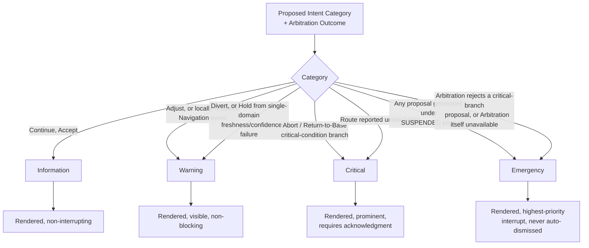

# Autonomous Flight Intelligence Platform (AFIP)
## Explainability Traceability Matrix

**Document ID:** AFIP-SE-009
**Document Type:** Systems Engineering — Explainability Traceability Matrix
**Status:** Draft v0.1
**Derived From:** AFIP Mission Executive v0.1; AFIP Health Monitoring System v0.1; AFIP Navigation System v0.1; AFIP Explainability Engine v0.1; AFIP Software Architecture v0.1
**Related Documents:** AFIP-SE-004 (State Machine Specification), AFIP-SE-005 (Sequence Diagrams), AFIP-SE-008 (Data Dictionary)
**Baseline vs. Implementation:** Every mapping below is sourced to the fixed decision-template set and alert-tier rules already specified in the Explainability Engine document. No new template, tier, or justification source is introduced.
**Scope of this document:** For every decision category AFIP can produce, this document states which justification sources are required, which XE template renders it, which alert tier it carries, and how its confidence is tagged — so that any decision AFIP makes can be traced end-to-end from triggering evidence to operator-facing explanation.

---

## 1. Purpose

AFIP-SE-002 and AFIP-SE-005 established *when* an explanation is generated. This document establishes *what must be present* in that explanation for each decision category, so that completeness can be verified (Document 8 — Verification & Validation, forthcoming set) against a fixed checklist rather than an ad hoc reading of the XE document.

---

## 2. Core Traceability Rule

Every rendered explanation must be traceable, without gaps, through exactly this chain (Architecture §4 flow rule 3; XE §5):

```
Evidence Record(s) → Belief Field(s) (Value/Confidence/Freshness/Provenance)
    → Domain Classification (HMS and/or ME)
    → Precedence-Evaluation Branch (ME §2 step 6)
    → Proposed Intent + Justification Reference Set (generated together)
    → Arbitration Outcome (Accept/Modify/Reject)
    → XE Template Selection (deterministic, not discretionary)
    → Rendered Explanation + Alert Tier
```

No step in this chain may be skipped, and no step may be reconstructed after the fact (Architecture P6) — the Justification Reference Set and the Arbitration Outcome are captured as a single, immutable pair at the moment they occur (XE §5 Stage 1).

---

## 3. Decision Category Traceability Matrix

| Decision Scenario | Triggering Branch | Proposed Intent | Typical Arbitration Outcome | XE Template | Alert Tier | Required Justification Sources | Confidence Treatment | Source |
|---|---|---|---|---|---|---|---|---|
| Nominal mission continuation | Nominal (no domain degraded) | Continue | Accept | (No dedicated named template — rendered via standard Decision Summary/Reasoning fields) | Information | Domain classifications (all nominal); Mission Progress belief | All domains at full confidence; deterministic | ME §2 step 6; XE §8 |
| Reduced-envelope continuation | Degraded domain, Cautious posture | Adjust | Accept or Modify | Standard Decision Summary/Reasoning fields | Warning | Degraded domain's Justification Reference Set; Executive Posture = CAUTIOUS | Domain-level confidence reduced; decision-level confidence reflects floor | ME §1.2; XE §6, §8 |
| Locally-resolved obstacle avoidance | Navigation event, no classification change | Continue (unaffected) or Adjust (bounded maneuver) | Accept | Standard fields; Route Status noted as evidence | Information (if fully resolved) / Warning (if reroute needed) | NS Route Status fact; Environment State Obstacle/Traffic Belief Field | NS-reported confidence carried through WSE reconciliation | NS §8; XE §8 |
| Freshness/confidence gate failure (single domain) | ME §2 step 1 | Hold | Accept | Standard fields | Warning | The specific domain marked unknown/insufficiently fresh | Domain explicitly marked unknown — never displayed as a numeric low value | ME §2 step 1; ME §7.4; XE §6.5 |
| Hover-phase Mission Executive fault | ME §6.2 (SUSPENDED posture) | Hold (minimal safe substitute) | Accept (still fully checked) | Standard fields, explicit justification gap noted | Emergency | None available in the normal sense — the gap itself is the content | Explicitly rendered as a gap, never fabricated | ME §6.2; XE §5 Stage 9; XE §8 |
| Cruise/transition-phase Mission Executive fault | ME §6.2 (SUSPENDED posture) | Return-to-Base (minimal safe substitute) | Accept (still fully checked) | Return Home (with explicit gap note) | Emergency | Same as above | Same as above | ME §6.2; XE §7.1, §5 Stage 9 |
| Critical health/navigation condition, RTB viable | ME §2 step 6 (critical branch); mission status not consulted | Return-to-Base | Accept | Return Home | Critical | HMS Critical/Emergency-tier classification and its specific Justification Reference Set | Deterministic-tagged; domain confidence floor applied | ME §2 step 6; HMS §9; XE §7.1 |
| Critical condition, RTB judged not safest | ME §2 step 6 (critical branch) + achievability judgment | Divert | Accept | Emergency Landing | Critical | HMS classification; NS ranked candidate sites and their suitability facts | Deterministic-tagged for health/nav; candidate-site confidence from NS | ME §2 step 6; NS §9; XE §7.2 |
| Route to target/base/candidate reported unreachable | NS §8 resolution step 3 | Re-proposed (Divert to next candidate, or re-attempted RTB) | Accept (on next viable proposal) | Emergency Landing or Return Home, re-rendered | Critical | NS Route Status = unreachable fact; updated candidate ranking | NS-reported confidence, reconciled through WSE | NS §8; ME §8.1; XE §7.1, §7.2 |
| Mission-risk condition, health/navigation nominal | ME §5.2, §8.3 (mission-risk branch) | Abort | Accept | Mission Abort | Critical | Mission-risk Justification Reference Set (e.g., energy trend vs. remaining distance); explicit confirmation that health/navigation are nominal | Mission-risk confidence tagged separately from health/navigation confidence — never blended | ME §8.3; XE §7.4, §6.4 |
| Mission landed, all domains nominal | Recognized phase transition (not an Arbitration event) | N/A (recognition, not proposal) | N/A | Mission Completed | Information | Confirmation that Health/Navigation/Mission classifications were all nominal at the moment of landing | All domains at full confidence by precondition of this template | XE §7.6 |
| Operator-originated command, accepted | Operator Interface Boundary | (Operator's proposed category) | Accept/Modify/Reject, identical check to ME proposals | Standard fields, source marked as Operator | Per proposal category, same rule as ME-originated | Same Arbitration check as any AFIP-originated proposal; no privilege | No confidence-value applies to the command itself; only to any Belief Fields cited in its justification | Architecture §3.6, P10; ME §6.4 |
| Proposal rejected by Arbitration | Any branch | (Any category) | Reject | Standard fields; explicitly records the rejection with equal weight to an acceptance | Matches or exceeds the tier the proposal itself would have carried, per structural rule (never demoted) | The constraint check that caused rejection | Deterministic — Arbitration's check is itself deterministic | Architecture §4 flow rule 3; XE §8 |
| Arbitration cannot produce a valid result | Any branch | (Any category) | Rejected by default (fail-closed) | Standard fields; explicitly records that Arbitration itself was inconclusive | Emergency | The absence of a valid Arbitration outcome itself | N/A — no confidence value substitutes for a missing check | Architecture Invariant 3; XE §5 Stage 9 |

---

## 4. Alert Tier Derivation Rule

Restated once here as the single source of truth for the "Alert Tier" column above (XE §8):



Two structural rules govern this derivation without exception (XE §8):

1. Alert priority is derived **deterministically** from proposal category and Arbitration outcome — never from the Explainability Engine's own assessment of operator workload.
2. A qualifying Critical/Emergency condition is **never displayed at a lower priority**, and a rejected or modified outcome is **never demoted** to reduce interruption.

---

## 5. Confidence-Tag Traceability

Every entry in the "Confidence Treatment" column of Section 3 draws from exactly one of the following tags, and no rendered explanation is permitted to blend them (XE §6, §5 Stage 2):

| Tag | Meaning | Source |
|---|---|---|
| Deterministic | Derived purely from Belief Field values and fixed rule evaluation, no advisory/model-based input involved | XE §5 Stage 2; Architecture §6 |
| Advisory-influenced | Involves an HMS Predicted Failure or Recommended Action (deterministic engineering model, not machine learning) that informed but did not itself decide the proposal | HMS §8; ME §7.3 |
| Unknown | Confidence for the relevant domain fell below its floor — displayed explicitly as unknown, never as a low numeric value | ME §7.4; XE §6.5 |

---

## 6. Worked Example — Full Traceability Chain

The following demonstrates the chain in Section 2 populated with a single representative scenario (Critical condition during CRUISE, RTB viable), for use as a template when verifying any other row of Section 3:

```mermaid
sequenceDiagram
    participant EV as Evidence (Motor temp sensor)
    participant WSE as World State Engine
    participant HMS as Health Monitoring System
    participant ME as Mission Executive
    participant ARB as Arbitration
    participant XE as Explainability Engine

    EV->>WSE: Raw motor temperature reading
    WSE->>WSE: Reconcile into Subsystem Health Belief Field (Value/Confidence/Freshness/Provenance)
    WSE->>HMS: Snapshot (includes updated Belief Field)
    HMS->>HMS: Motors/ESCs sub-score crosses Critical threshold (HMS §9)
    HMS->>ME: Health Domain Judgment: Overall Health = Critical, Justification Reference Set attached
    ME->>ME: Precedence evaluation: critical branch (ME §2 step 6); mission status not consulted
    ME->>ARB: Proposed Intent = Return-to-Base + Justification Reference Set
    ARB->>ARB: Check against constraint set
    ARB-->>ME: Outcome = Accept
    ME->>XE: Justification Reference Set + Outcome (captured as one pair)
    XE->>XE: Select template = Return Home (XE §7.1); Alert Tier = Critical (XE §8)
    XE-->>OP: Rendered Explanation: Decision Summary, Reasoning (motor Critical), Confidence (deterministic), Evidence (sub-score + Belief Field), Alternatives (Divert considered, RTB chosen as safest), Operator Messages
```

Every arrow in this diagram corresponds to an ICD interface already defined in AFIP-SE-003, confirming that this worked example introduces no new mechanism — it is simply Section 3's "Critical health/navigation condition, RTB viable" row traced in full.

---

## 7. Traceability and Open Items

This matrix is complete with respect to the fixed template set (Return Home, Emergency Landing, Mission Abort, Mission Completed) and the standard (non-templated) rendering path used for Continue/Adjust/Hold scenarios that do not have a dedicated named template (XE §7). No additional template is introduced. The open items carried from AFIP-SE-004 §6 (ASCENT/APPROACH-DESCENT fault classification) affect which template applies during a Mission Executive fault occurring in those two phases specifically, and remain unresolved here for the same reason stated there.

---

**End of Document 9 — Explainability Traceability Matrix**
