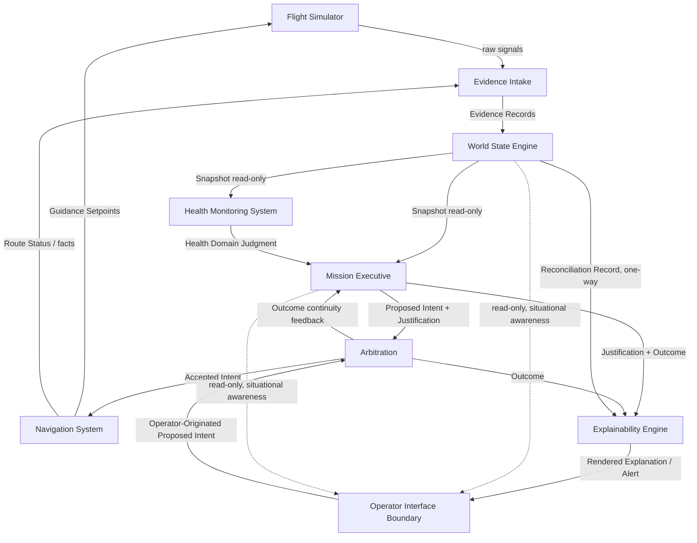

# Autonomous Flight Intelligence Platform (AFIP)
## Module Dependency & Ownership Matrix

**Document ID:** AFIP-SE-010
**Document Type:** Systems Engineering — Module Dependency and Ownership Matrix
**Status:** Draft v0.1
**Derived From:** AFIP Software Architecture v0.1; AFIP World State Engine v0.1; AFIP Mission Executive v0.1; AFIP Navigation System v0.1; AFIP Health Monitoring System v0.1; AFIP Explainability Engine v0.1
**Related Documents:** AFIP-SE-001 (Data Flow §7), AFIP-SE-003 (ICD)
**Baseline vs. Implementation:** Ownership and dependency relationships below are fixed by the baseline architecture's single-writer and no-skip rules. No module's authority or ownership is changed by this document.
**Scope of this document:** A single consolidated matrix of every module's write ownership, read dependencies, and explicitly excluded relationships — the definitive reference for "who is allowed to touch what."

---

## 1. Purpose

AFIP-SE-001 §7 stated the single-writer discipline narratively. This document restates it exhaustively, per module, in matrix form, and adds the "explicitly excluded" column that later documents (Hazard Analysis, V&V Matrix) depend on to verify that a forbidden dependency was never introduced.

---

## 2. Module Ownership and Dependency Matrix

| Module | Owns (Sole Writer Of) | Reads (Depends On) | Explicitly Excluded (Never Reads/Writes) | Authority Level |
|---|---|---|---|---|
| **Evidence Intake** | Evidence Records (source + time tag only) | Raw signals from Flight Simulator/sensors | Never interprets, fuses, or judges evidence (Architecture §3.1) | None — pass-through only |
| **World State Engine** | Aircraft State, Environment State, Mission State, World State Snapshot, Reconciliation Record, all Belief Fields | Evidence Records only | Never reads a Proposed Intent, Arbitration Outcome, or any Layer C/D/E object (WSE §8) | Sole authority over belief formation |
| **Health Monitoring System** | Overall Health classification, Health Score, Warnings, Predicted Failures, Recommended Actions, Mission Readiness | World State Snapshot (read-only) | Never writes to the WSE; has no proposal authority and no path to the flight-control boundary (HMS §0) | Advisory input to Mission Executive only |
| **Mission Executive (Proposal function)** | Proposed Intent, Justification Reference Set, Active Intent Register, Last-Cycle Outcome (continuity state, not belief) | World State Snapshot; HMS Health Domain Judgment; Arbitration Outcome (continuity feedback) | Never writes to the WSE; has no further influence over a Proposed Intent once it crosses to Arbitration (ME §2 step 9) | Proposes only — no authority to command actuation |
| **Arbitration** | Arbitration Outcome (Accept/Modify/Reject) | Proposed Intent (from ME or Operator) | Owns no World Model object; acts on proposals, never writes belief (Architecture §3.4) | Sole checking authority — structurally distinct from Proposal |
| **Navigation System** | Desired Route, Next Waypoint, Desired Heading/Speed/Altitude, Route Status, ETA, candidate site rankings | Accepted Intent (from Arbitration only) | Never reads the WSE Snapshot directly; never writes to the WSE; never issues actuator/control-surface commands (NS §11.1, §11.2, §4.3) | Executes accepted strategic intent tactically — no strategic authority of its own |
| **Explainability Engine** | Rendered Explanation, Alert assignment | Justification Reference Set + Arbitration Outcome (captured pair); Reconciliation Record (one-way) | Never writes back into any object it reads; never adds a fact, judgment, or decision not already produced upstream (XE §0) | Renders only — no decision authority |
| **Operator Interface Boundary** | Operator-Originated Proposed Intent, Alert Acknowledgment | All World Model/decision objects (read-only, for situational awareness) | Never bypasses Arbitration; carries no privileged or unchecked command channel (Architecture §3.6, P10) | Proposes on equal footing with Mission Executive — no elevated authority |

---

## 3. Dependency Graph

**Reading this graph:** every solid arrow is a permitted, specified dependency (Section 2). No dashed/excluded relationship is drawn as a solid arrow anywhere in this diagram — in particular, there is no arrow from HMS or NS directly to XE, no arrow from NS to WSE, and no arrow from ARB to WSE, consistent with Section 2's "Explicitly Excluded" column.

---

## 4. Single-Writer Verification Table

Restated as a direct verification aid: for every object in the Data Dictionary (AFIP-SE-008), exactly one module owns it.

| Object | Sole Writer | All Other Modules |
|---|---|---|
| Evidence Record | Evidence Intake | Read-only: World State Engine |
| Belief Field (any) | World State Engine | Read-only: HMS, Mission Executive (via Snapshot only) |
| World State Snapshot | World State Engine | Read-only: HMS, Mission Executive |
| Reconciliation Record | World State Engine | Read-only: Explainability Engine (one-way) |
| Health Domain Judgment | Health Monitoring System | Read-only: Mission Executive |
| Proposed Intent + Justification | Mission Executive | Read-only: Arbitration, Explainability Engine |
| Active Intent Register / Last-Cycle Outcome | Mission Executive | Internal to Mission Executive only |
| Arbitration Outcome | Arbitration | Read-only: Mission Executive (continuity), Navigation System (as Accepted Intent), Explainability Engine |
| Desired Route / Setpoints | Navigation System | Read-only: Flight Simulator's guidance interface |
| Route Status / ETA / Candidate Sites | Navigation System | Read-only: Evidence Intake (re-entering as evidence) |
| Rendered Explanation / Alert | Explainability Engine | Read-only: Operator Interface Boundary |
| Operator-Originated Proposed Intent | Operator Interface Boundary | Read-only: Arbitration |

No object in this table has more than one writer. This is the mechanical verification that AFIP-SE-001 §7's single-writer rule holds across the entire system, not merely within any one layer.

---

## 5. Traceability Notes

Every ownership and dependency relationship above is sourced to the same sections already cited in AFIP-SE-001 §7 and AFIP-SE-003. This document adds no new relationship — it exists to make the complete set verifiable in one place, including the negative space (what is explicitly excluded), which prior documents stated narratively but did not tabulate exhaustively.

---

**End of Document 10 — Module Dependency & Ownership Matrix**
