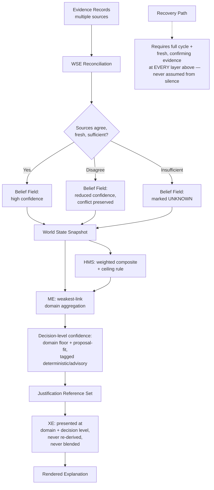

# Autonomous Flight Intelligence Platform (AFIP)
## Confidence Propagation Specification

**Document ID:** AFIP-SE-011
**Document Type:** Systems Engineering — Confidence Propagation Specification
**Status:** Draft v0.1
**Derived From:** AFIP World State Engine v0.1; AFIP Mission Executive v0.1; AFIP Health Monitoring System v0.1; AFIP Explainability Engine v0.1
**Related Documents:** AFIP-SE-003 (ICD §5), AFIP-SE-008 (Data Dictionary), AFIP-SE-009 (Explainability Traceability Matrix)
**Baseline vs. Implementation:** Every rule below is sourced from the baseline documents' own confidence-handling sections. No new confidence computation, aggregation method, or decay rule is introduced.
**Scope of this document:** The complete, end-to-end specification of how confidence is created, aggregated, tagged, decayed, and recovered as it moves through every layer of AFIP — expanding the global rule first stated in AFIP-SE-003 §5 into its full derivation chain.

---

## 1. Purpose

Confidence is not a single number computed once — it is a value that is **created exactly once**, then **carried, aggregated, and re-tagged** by fixed rules at every layer above its point of creation. This document is the authoritative reference for every one of those rules, in the order confidence actually flows through the system.

---

## 2. Where Confidence Is Created

Confidence is created **exactly once** in all of AFIP: at the World State Engine, during reconciliation of Evidence Records into Belief Fields (WSE §3.2). No layer downstream of the WSE is permitted to invent a new confidence value from raw evidence — every downstream confidence figure is either inherited unchanged or aggregated from WSE-originated values by a fixed rule (Mission Executive §7.1; HMS §7.4; XE §6).

### 2.1 Confidence Derivation at the WSE

| Factor | Effect on Confidence | Source |
|---|---|---|
| Multiple independent sources agree | Confidence increases | WSE §3.2 |
| Sources disagree | Confidence decreases; the disagreement itself is preserved in the Reconciliation Record, never resolved by preference or averaging | WSE §3.2, §7 row 2 |
| Evidence is stale (outside freshness window) | Confidence decreases | WSE §3.2, §5.3 |
| Insufficient evidence exists at all | Field is marked **unknown**, a distinct state from "low confidence" — never a bare zero or default value | WSE §7 row 3 |

---

## 3. Confidence Is a Compound, Never a Bare Number

Every Belief Field carries confidence as one of four inseparable components (WSE §3.2; AFIP-SE-008 §2):

```
Belief Field = { Value, Confidence, Freshness, Provenance }
```

No consumer anywhere in AFIP is ever handed a Value without its accompanying Confidence, Freshness, and Provenance (WSE §6). This is why "confidence propagation" is really "Belief Field propagation" — the four travel together at every interface (AFIP-SE-003 §5, rule 1).

---

## 4. Aggregation Rules by Layer

### 4.1 Health Monitoring System — Weighted Composite with Ceiling Rule

| Rule | Behavior | Source |
|---|---|---|
| Weighted composite | Sub-domain scores combine into the Health Score using fixed weights (e.g., Battery/Power 30%, Motors/ESCs 25% — AFIP-SE-008 §4) | HMS §7.1, §7.2 |
| Ceiling rule | Two or more concurrent Critical-tier sub-domain conditions force the Overall Health classification to critical (Emergency tier) **regardless of** what the weighted composite alone would indicate | HMS §7.1, §9 |
| Confidence floor per sub-domain | If a sub-domain's supporting Belief Fields fall below its own confidence floor, that sub-domain is marked unknown, not given an optimistic default score | HMS §7.4 |

**Why a ceiling rule and not a pure weighted average:** a weighted average could mathematically dilute two genuinely critical conditions into a merely "elevated" composite score — the ceiling rule exists specifically to prevent that dilution (HMS §7.1).

### 4.2 Mission Executive — Weakest-Link Aggregation

| Rule | Behavior | Source |
|---|---|---|
| Domain-level confidence | Aggregated from the relevant Belief Fields using **weakest-link** logic — the domain's confidence is no higher than its least-confident material contributor, never an average | Mission Executive §7.2 |
| Decision-level confidence | Combines the domain confidence floor with proposal-fit confidence (how well the proposal category matches the evaluated condition) | Mission Executive §7.3 |
| Deterministic vs. advisory-influenced tagging | Every confidence figure is tagged according to whether it derives purely from Belief Field/rule evaluation, or was influenced by an HMS Predicted Failure/Recommended Action; the two tags are never blended into one indistinguishable figure | Mission Executive §7.3; Architecture §6 |
| Unknown propagation | If a domain is marked unknown at the WSE/HMS level, the Mission Executive's own evaluation of that domain is also unknown — it does not attempt to compute a number where the underlying data does not support one | Mission Executive §7.4 |

**Why weakest-link and not averaged:** averaging would let one highly-confident Belief Field mask another, less-confident one that actually governs safety — weakest-link logic exists specifically to prevent one strong signal from hiding a weak one (Mission Executive §7.2).

### 4.3 Explainability Engine — Presentation Without Re-Derivation

| Rule | Behavior | Source |
|---|---|---|
| No new confidence value | The XE never computes a confidence figure itself — every figure it renders was already computed upstream | XE §6, §0 |
| Multi-level, never-collapsed presentation | Domain-level and decision-level confidence are both surfaced, never merged into one summary number | XE §6 |
| Unknown stays unknown | A domain reported as unknown by HMS/ME is displayed as unknown text, never rounded into a numeric low-confidence value | XE §6.5 |
| Deterministic/advisory tag preserved | The tag applied at the ME level is carried through unchanged to the final rendered output | XE §5 Stage 2, §6.4 |

---

## 5. Confidence Decay (Freshness) Discipline

| Rule | Behavior | Source |
|---|---|---|
| Every Belief Field has a freshness window | A value not refreshed within its window is treated as degrading, not treated as still-current | WSE §5.3 |
| Continuous fields degrade continuously | Kinematic/Pose, Propulsion/Actuation, Power/Energy confidence decays smoothly as freshness lapses | WSE §5.2, §5.3 |
| Event-driven fields degrade on the applicable trigger | Payload, Subsystem Health confidence is reassessed on the relevant event (e.g., a new sensor reading), not on a clock | WSE §5.2 |
| Stale data is never presented as current | This is a hard rule at every layer, not merely a WSE-level convention — HMS, ME, and XE all inherit and respect the freshness state rather than treating an old-but-not-yet-expired value as equivalent to a fresh one | WSE §5.4; HMS §7.4; ME §7.4 |

---

## 6. Confidence Recovery Discipline

This is the single most important asymmetry in AFIP's confidence handling, restated here as the authoritative rule (previously introduced in AFIP-SE-002 §4 rule 2 and AFIP-SE-007 §6):

> **Confidence degrades immediately on a qualifying condition. Confidence recovers only after a full reasoning cycle confirms — against fresh, materially supporting evidence — that the condition has genuinely cleared. The mere absence of new bad evidence is never sufficient for recovery.**

| Layer | Recovery Rule | Source |
|---|---|---|
| World State Engine | A Belief Field's confidence rises only when new, agreeing, fresh evidence actively supports it — not merely because no new conflicting evidence arrived | WSE §3.2, §5.4 |
| Health Monitoring System | Overall Health classification upgrades only after a full aggregation cycle confirms the previously-Critical/Degraded sub-domain has cleared | HMS §9 |
| Mission Executive | Executive Posture upgrades only after a full reasoning cycle confirms the triggering condition has cleared against a fresh, confident Snapshot | Mission Executive §1.2, §7.5 |
| Explainability Engine | Never independently asserts recovery — it only reflects the recovery state already established by ME/HMS | XE §6.6 |

---

## 7. Confidence Propagation Flow Diagram



---

## 8. Confidence Tagging Summary Table

Consolidated from AFIP-SE-009 §5, restated here as the authoritative definition (not merely a cross-reference):

| Tag | Meaning | Where Assigned | Where Consumed |
|---|---|---|---|
| Deterministic | Derived purely from Belief Field values and fixed rule evaluation | WSE (base value); Mission Executive (aggregation) | Explainability Engine (rendered unchanged) |
| Advisory-influenced | Involves an HMS Predicted Failure or Recommended Action (deterministic engineering model, never machine learning) | Health Monitoring System; carried by Mission Executive | Explainability Engine (rendered unchanged, never merged with deterministic tag) |
| Unknown | Confidence fell below the relevant floor; treated as a distinct state, never a numeric low value | World State Engine (field-level); Health Monitoring System (sub-domain-level); Mission Executive (domain-level) | Explainability Engine (rendered as explicit "unknown" text) |

---

## 9. Traceability Notes

Every rule in this document is sourced to the confidence-handling section of its owning system's document, and none introduces a new aggregation method, decay rule, or recovery criterion beyond what the baseline already specifies. This document exists to assemble those rules — previously stated once each in WSE §3.2/§5, Mission Executive §7, HMS §7, and XE §6 — into a single, layer-by-layer derivation chain.

---

**End of Document 11 — Confidence Propagation Specification**
