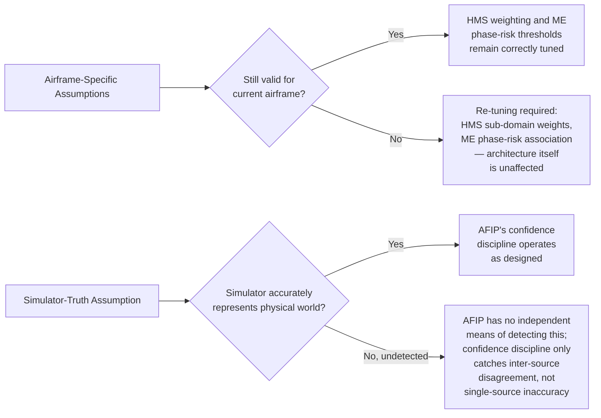

# Autonomous Flight Intelligence Platform (AFIP)
## System Constraints & Assumptions

**Document ID:** AFIP-SE-012
**Document Type:** Systems Engineering — Constraints and Assumptions Register
**Status:** Draft v0.1
**Derived From:** AFIP Product Specification v0.2; AFIP Software Architecture v0.1; AFIP World State Engine v0.1; AFIP Mission Executive v0.1; AFIP Navigation System v0.1; AFIP Health Monitoring System v0.1; AFIP Explainability Engine v0.1
**Supporting Reference Material (not baseline):** Architectural Blueprint for High-Level Autonomy Stacks; Drone Aerodynamic CFD Analysis Report; First Principles: Information-Centric Architecture
**Baseline vs. Implementation:** Section 2 constraints are architectural and non-negotiable by definition — no implementation may relax them. Section 3 assumptions are physical/airframe-specific facts the baseline design relies on; where the current implementation phase depends on a numeric value not stated in the baseline (e.g., a specific drag coefficient), it is marked as an **Implementation Note**, sourced to the supporting CFD report rather than to any of the seven core AFIP specifications.
**Scope of this document:** Every hard constraint AFIP's architecture imposes on itself, and every assumption its design relies on but does not itself prove — assembled in one place so that a reviewer can distinguish "this cannot change without a redesign" from "this is believed true but depends on the airframe/environment."

---

## 1. Purpose

Previous documents (AFIP-SE-001 through AFIP-SE-011) each stated constraints and assumptions relevant to their own scope, in passing. This document consolidates them into two registers — Constraints (Section 2) and Assumptions (Section 3) — and clarifies which supporting reference documents inform, but do not define, AFIP's baseline (Section 4).

---

## 2. Architectural Constraints (Non-Negotiable)

| Constraint | Statement | Enforcement Mechanism | Source |
|---|---|---|---|
| No-skip layering | A layer may only exchange information with the layer immediately adjacent to it | Every ICD interface (AFIP-SE-003) only connects adjacent layers; no interface bypasses a layer | Architecture §2 |
| Single writer | Every object has exactly one writer; every other module is a read-only consumer | Ownership Matrix (AFIP-SE-010 §2, §4) | WSE §4; Architecture §4 |
| Belief/intent separation | Belief (WSE) and intent (Mission Executive/Arbitration) are never the same structure and are never merged | Distinct object types throughout the Data Dictionary (AFIP-SE-008 §3, §5) | Architecture P4, Invariant 5 |
| No unchecked proposal path | Every proposed intent, from AFIP or from a human operator, passes through Arbitration before reaching the flight-control boundary | ICD-AFIP-006/007 both terminate at Arbitration, never bypass it | Architecture Invariant 2 |
| Fail-closed arbitration | Absence of a valid Arbitration result is treated as rejection, never as permission | Failure Mode Matrix (AFIP-SE-006 §5, row 1) | Architecture Invariant 3 |
| No advisory-to-intent shortcut | Advisory (model/statistical) judgment never directly produces a proposed intent; it only ever informs deterministic judgment | HMS has no proposal authority (AFIP-SE-010 §2); Recommended Actions carry no authority of their own (HMS §5) | Architecture P5 |
| Deterministic-only safety path | No machine learning or statistical pattern-classification model is used anywhere in the Health Monitoring System's failure-prediction function | HMS §8 opening statement | HMS §8 |
| No write-back into upstream objects | Layer C, D, and E have no write path into any WSE object; the Navigation System never writes to the WSE; the Explainability Engine never writes back into anything it reads | Ownership Matrix (AFIP-SE-010 §2) | WSE §8; NS §11.2; XE §0 |
| No AFIP authority over physical truth or low-level control | AFIP never duplicates, overrides, or second-guesses the Flight Simulator's ownership of physical truth, and never issues an actuator or control-surface command | ICD-AFIP-010 data contract excludes actuator commands (AFIP-SE-003 §3) | Product Spec §4, §10; NS §4.3 |
| Escalation-fast, recovery-slow asymmetry | Any downgrade (posture, alert tier, classification) is immediate; any upgrade requires a full reasoning cycle against fresh, confirming evidence | Confidence Propagation Specification (AFIP-SE-011 §6) | Mission Executive §1.2, §7.5; HMS §9 |
| Explanation is contemporaneous, not reconstructed | Every decision is recorded and explained at the moment it is made, never after the fact | Explainability Traceability Matrix (AFIP-SE-009 §2) | Architecture P6 |
| No mission self-redefinition | The Mission Executive has no authority to redefine the mission objective, extend a deadline, or invent an alternate mission; Abort is a fixed response category | State Machine Specification (AFIP-SE-004 §2.3.8, ABORT entry) | Mission Executive §8.5 |

---

## 3. Physical and Environmental Assumptions

These are facts about the specific airframe and its operating environment that the baseline design relies on. Unlike Section 2, these are not architectural rules — they are assumptions that, if invalidated (e.g., by a different airframe), would require re-tuning HMS weighting and Mission Executive risk thresholds without necessarily changing the architecture itself.

| Assumption | Rationale | Risk if Invalid | Source |
|---|---|---|---|
| The airframe is a dual-rotor, ducted-fan, tilt-rotor design with distinct hover, transition, and cruise configurations | Directly shapes the Mission Phase State's ASCENT/TRANSITION/CRUISE structure (AFIP-SE-004 §2) | A fixed-wing or conventional-multirotor airframe would not exhibit a "transition" phase at all, changing the phase state machine's shape | Product Spec §10; AFIP-SE-004 §2 |
| Ducted fans place their highest thermal load on the airframe during hover and transition, not cruise | Directly justifies HMS's Motors/ESCs weighting (25%) and its phase-aware evaluation (HMS §6.2, §7.2) | If this were false for a given build, HMS's weighting would misjudge risk during the wrong phase | HMS §6.2, §7.2 |
| Cruise is this airframe's highest energy-consumption phase | Directly justifies HMS's Battery/Power weighting (30%, the highest of any sub-domain) (HMS §7.2) | A different consumption profile would require re-weighting, not a new architecture | HMS §7.2 |
| The airframe exhibits positive pitching moment, negative lift (downforce), and high drag specifically in forward (cruise) flight | Directly justifies why Mission Executive §8.3 treats eroding energy margin during CRUISE as independently sufficient grounds for an Adjust/Divert proposal | If the airframe's aerodynamic profile differed, the specific phase in which mission risk dominates could shift | Product Spec §2.2 |
| The Flight Simulator is the sole, trustworthy source of physical truth | Everything AFIP reasons about ultimately traces back to simulator-originated evidence | If the simulator itself were inaccurate, AFIP's confidence discipline (Section 6 of AFIP-SE-011) would reduce trust in resulting beliefs, but AFIP has no independent means of detecting simulator-side inaccuracy beyond source disagreement | Product Spec §10 |

**Implementation Note.** The supporting CFD analysis (not a baseline document) reports specific numeric aerodynamic coefficients for this airframe at a 15 m/s test condition (drag coefficient, lift coefficient, pitching moment coefficient) and explicitly cautions that the drag coefficient figure is inflated by an estimated (not measured) reference area. These specific numeric values are not asserted anywhere in the seven baseline AFIP documents and are not treated as baseline requirements here — they inform, but do not define, the qualitative assumption above ("high drag, negative lift, positive pitching moment in cruise") that Product Spec §2.2 does assert as baseline.

---

## 4. Reference Material vs. Baseline — Explicit Boundary

Four supporting documents were provided alongside the seven core AFIP specifications. None of them is part of the architectural baseline; each is used only as indicated below, and no statement in this document (or any AFIP-SE-0## document) treats them as authoritative over the seven baseline specs.

| Document | Role | How It Is Used | How It Is Not Used |
|---|---|---|---|
| Architectural Blueprint for High-Level Autonomy Stacks | Industry-pattern comparison (Tesla, Waymo, Skydio, Anduril, Shield AI, Zipline, Wing) and a gap analysis specifically written *about* an AFIP-like architecture sitting above PX4 | Used only as external validation that AFIP's layering (evidence→belief→reasoning→decision→arbitration→explanation) mirrors recognized industry patterns, particularly the "Simplex Safety Firewall" concept it names, which corresponds to AFIP's own Arbitration function | Not used to introduce any object, interface, or rule not already present in the seven baseline documents; its terminology ("Simplex Architecture," "Common Operational Picture") is not substituted for AFIP's own terminology anywhere in this document set |
| Drone Aerodynamic CFD Analysis Report | Physical/aerodynamic test data for the airframe modeled in the accompanying CAD file | Used only to corroborate the qualitative aerodynamic assumption already stated in Product Spec §2.2 (Section 3 above) | Not used to assert a specific numeric coefficient as a baseline requirement (see Implementation Note, Section 3) |
| First Principles: Information-Centric Architecture | A general-purpose reference model for information-centric autonomy design (the "Six Questions," a generic multi-object World Model with 11 illustrative object types) | Used only as the source of the general event-driven-vs-continuous data distinction adopted in AFIP-SE-002 §2 and AFIP-SE-007 §2, since AFIP's own WSE document uses this same distinction without re-deriving it from scratch | **Not used as a substitute World State Engine specification.** Its 11-object catalog (AircraftState, MissionState, NavigationState, BatteryState, HealthState, CargoState, TrafficState, CommunicationState, WeatherState, OperatorState, plus a generic World Model philosophy) is a general reference architecture, not AFIP's own object catalog — AFIP-SE-008 uses only the WSE document's own three-object structure (Aircraft State, Environment State, Mission State) |
| CAD model (drone_3D) | Physical airframe geometry corresponding to the CFD report | Not referenced in any AFIP-SE-0## document beyond acknowledging its existence as the subject of the CFD report | Not used to derive any AFIP behavioral requirement |

This boundary is stated explicitly because the reference documents share vocabulary with the baseline (e.g., "World Model," "occupancy grid," "Simplex Architecture") that could otherwise be mistaken for AFIP's own specified terms. Wherever this document set uses a term like "World State Snapshot" or "Belief Field," it refers exclusively to the definition given in the AFIP World State Engine document (AFIP-SE-008 §2–§3), never to the reference documents' own, differently-scoped terms.

---

## 5. Assumption Risk Summary

This diagram exists to make explicit a real limitation, not to imply it is currently observed: AFIP's confidence discipline (AFIP-SE-011) reduces trust when sources *disagree*, but has no independent mechanism to detect a single, internally-consistent but factually wrong source — including the simulator itself. This is stated here as an assumption risk, not resolved, consistent with this document's role as a register rather than a design change proposal.

---

## 6. Traceability and Open Items

Every constraint in Section 2 and every assumption in Section 3 is sourced to a specific section of a baseline document, with the sole exception of the Implementation Note in Section 3, which is explicitly sourced to the supporting CFD report and explicitly marked as non-baseline. Open items already carried forward from AFIP-SE-004 §6, AFIP-SE-006 §9, and AFIP-SE-007 §7 remain open and are not restated in full here.

---

**End of Document 12 — System Constraints & Assumptions**
