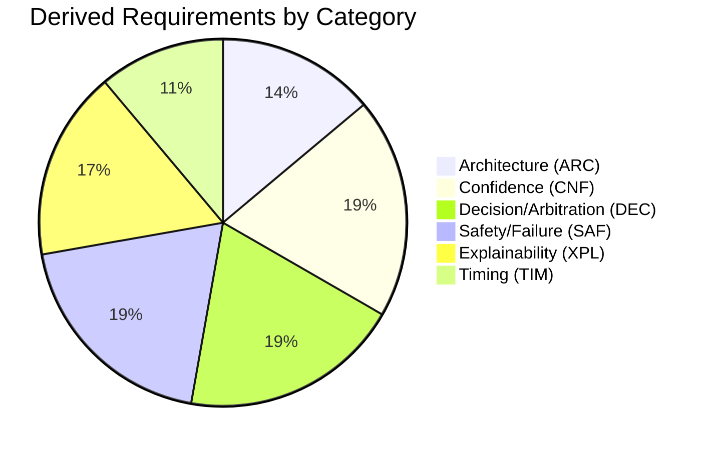

# Autonomous Flight Intelligence Platform (AFIP)
## Requirements Traceability Matrix (RTM)

**Document ID:** AFIP-SE-013
**Document Type:** Systems Engineering — Requirements Traceability Matrix
**Status:** Draft v0.1
**Derived From:** All seven core AFIP specifications
**Related Documents:** AFIP-SE-001 through AFIP-SE-012
**Baseline vs. Implementation:** The source documents are written as architectural narrative, not as an enumerated requirements list. Every requirement below is therefore a **Derived Requirement** — a testable statement extracted from a specific architectural rule, invariant, or design principle already asserted in the baseline — never an invented capability. Each is traced to its exact source statement.
**Scope of this document:** A single matrix connecting every derived requirement to the design element(s) that satisfy it, the verification method appropriate to it, and the prior AFIP-SE document that already provides (or will provide, per the forthcoming test/V&V documents) that verification evidence.

---

## 1. Derivation Method

Each row below follows this rule: a requirement is only listed if it is a direct restatement of a "must," "never," "always," "sole," "only," or equivalent binding statement already present in the baseline documents. Requirements are grouped by category for readability; the Req ID prefix indicates the category.

**Verification Method key** (standard systems engineering categories):
- **I** — Inspection (reviewing the design/document itself)
- **A** — Analysis (reasoning about the design against the requirement, e.g., tracing a matrix)
- **D** — Demonstration (showing the behavior occurs in a representative scenario)
- **T** — Test (executing a specific, repeatable check against defined pass/fail criteria)

---

## 2. Layering and Architecture Requirements (REQ-ARC-###)

| Req ID | Requirement Statement | Source | Design Element(s) | Verification Method | Verification Reference |
|---|---|---|---|---|---|
| REQ-ARC-001 | AFIP shall exchange information only between adjacent layers; no layer shall skip a layer to reach another | Architecture §2 | ICD interface set | A | AFIP-SE-003 §2; AFIP-SE-010 §3 |
| REQ-ARC-002 | Every World Model object shall have exactly one writer | WSE §4; Architecture §4 | WSE object model | A | AFIP-SE-008 §3; AFIP-SE-010 §4 |
| REQ-ARC-003 | Belief and intent shall never be represented as the same structure | Architecture P4, Invariant 5 | WSE Belief Field vs. ME Proposed Intent | I | AFIP-SE-008 §2, §5 |
| REQ-ARC-004 | No layer above Evidence Intake shall reason directly on raw, unreconciled evidence | Architecture Invariant 1 | ICD-AFIP-002 (Evidence Record delivery, WSE-only) | A | AFIP-SE-003 §3 |
| REQ-ARC-005 | No sub-object of the World State Snapshot shall be exposed to Layer C individually | WSE §6, §8 | Snapshot publication mechanism | I | AFIP-SE-003 §3 (ICD-AFIP-003/004) |

---

## 3. Belief, Confidence, and Freshness Requirements (REQ-CNF-###)

| Req ID | Requirement Statement | Source | Design Element(s) | Verification Method | Verification Reference |
|---|---|---|---|---|---|
| REQ-CNF-001 | Every Belief Field shall carry Value, Confidence, Freshness, and Provenance inseparably | WSE §3.2 | Belief Field structure | I | AFIP-SE-008 §2 |
| REQ-CNF-002 | Confidence shall be created only at the World State Engine; no downstream module shall invent a new confidence value from raw evidence | WSE §3.2; ME §7.1; HMS §7.4 | Confidence propagation chain | A | AFIP-SE-011 §2, §4 |
| REQ-CNF-003 | Domain-level confidence aggregation shall use weakest-link logic, never averaging | ME §7.2 | Mission Executive domain evaluation | A | AFIP-SE-011 §4.2 |
| REQ-CNF-004 | Health Score aggregation shall apply a ceiling rule: two or more concurrent Critical sub-domain conditions shall force Emergency-tier classification regardless of the weighted composite | HMS §7.1, §9 | HMS aggregation logic | T | AFIP-SE-011 §4.1; AFIP-SE-006 §4 |
| REQ-CNF-005 | A field/domain with insufficient supporting evidence shall be marked "unknown," never assigned a default or averaged value | WSE §7 row 3; HMS §7.4; ME §7.4 | Confidence tagging discipline | T | AFIP-SE-011 §8 |
| REQ-CNF-006 | Confidence recovery (upgrade) shall require a full reasoning cycle confirming the triggering condition has cleared against fresh, confirming evidence; recovery shall never be assumed from the mere absence of new bad evidence | ME §1.2, §7.5; HMS §9 | Posture/classification recovery logic | T | AFIP-SE-011 §6; AFIP-SE-004 §3.2 |
| REQ-CNF-007 | Deterministic and advisory-influenced confidence shall be tagged distinctly and never blended into one figure | ME §7.3; XE §6.4; Architecture §6 | Confidence tagging pipeline | A | AFIP-SE-011 §8; AFIP-SE-009 §5 |

---

## 4. Decision and Arbitration Requirements (REQ-DEC-###)

| Req ID | Requirement Statement | Source | Design Element(s) | Verification Method | Verification Reference |
|---|---|---|---|---|---|
| REQ-DEC-001 | Every Proposed Intent, regardless of source (Mission Executive or Operator), shall pass through Arbitration before reaching the flight-control boundary | Architecture Invariant 2; ME §6.4 | ICD-AFIP-006/007/008 | D | AFIP-SE-003 §3; AFIP-SE-005 §4 |
| REQ-DEC-002 | Absence of a valid Arbitration result shall be treated as rejection, never as implicit approval | Architecture Invariant 3 | Arbitration fail-closed logic | T | AFIP-SE-006 §5 |
| REQ-DEC-003 | A Proposed Intent and its Justification Reference Set shall be generated together as a single unit, never staggered | ME §2 step 8; Architecture P6 | Mission Executive decision flow | I | AFIP-SE-005 §2 (canonical cycle, property 3) |
| REQ-DEC-004 | The Mission Executive shall have no further influence over a Proposed Intent once it has been handed to Arbitration | ME §2 step 9 | Mission Executive/Arbitration boundary | I | AFIP-SE-003 §3 (ICD-AFIP-006) |
| REQ-DEC-005 | A critical-condition-branch proposal shall not consult mission status at the point of generation | ME §2 step 6 | Precedence evaluation logic | T | AFIP-SE-005 §4.3 (RTB sequence) |
| REQ-DEC-006 | The Mission Executive shall have no authority to redefine the mission objective; Abort shall remain a fixed response category | ME §8.5 | Mission Executive authority boundary | I | AFIP-SE-004 §2.3.8 (ABORT) |
| REQ-DEC-007 | An Operator-Originated Proposed Intent shall receive no structural privilege or bypass relative to a Mission-Executive-originated proposal | Architecture §3.6, P10 | Operator Interface Boundary | D | AFIP-SE-003 §3 (ICD-AFIP-007) |

---

## 5. Safety and Failure-Handling Requirements (REQ-SAF-###)

| Req ID | Requirement Statement | Source | Design Element(s) | Verification Method | Verification Reference |
|---|---|---|---|---|---|
| REQ-SAF-001 | Any fault at any layer shall result in that layer reducing its own confidence/authority, never in it acting harder to compensate | Architecture §7 | Cross-layer fault-handling discipline | A | AFIP-SE-006 §8 |
| REQ-SAF-002 | A Mission Executive proposal-function fault shall set Executive Posture to SUSPENDED and substitute a single, pre-defined minimal safe proposal, still fully arbitrated | ME §6.2 | Mission Executive fault handling | T | AFIP-SE-004 §3.3.4; AFIP-SE-006 §4 |
| REQ-SAF-003 | A hover-phase Mission Executive fault shall default to a Hold minimal safe proposal; a cruise- or transition-phase fault shall default to a Return-to-Base minimal safe proposal | ME §6.2 | Mission Phase-aware fault defaults | T | AFIP-SE-004 §2.3.3, §2.3.5, §3.3.4 |
| REQ-SAF-004 | The Navigation System shall never issue an actuator or control-surface command under any condition | NS §4.3; Product Spec §4 | Navigation System output boundary | I | AFIP-SE-003 §3 (ICD-AFIP-010) |
| REQ-SAF-005 | On loss of the Accepted Intent channel, the Navigation System shall continue executing the last Accepted Intent and shall never invent a new strategic intent | NS §10 | Navigation System comm-loss handling | T | AFIP-SE-006 §6 |
| REQ-SAF-006 | The Navigation System shall report route infeasibility as fact; it shall never substitute a new destination on its own authority | NS §8 resolution step 3; ME §8.1 | Navigation System / Mission Executive achievability boundary | D | AFIP-SE-006 §6 |
| REQ-SAF-007 | The Safety/Arbitration function shall be structurally distinct from the Proposal function, such that the module proposing an action is never the module approving it | Architecture §3.4 | Layer D internal separation | I | AFIP-SE-010 §2 |

---

## 6. Explainability and Record Requirements (REQ-XPL-###)

| Req ID | Requirement Statement | Source | Design Element(s) | Verification Method | Verification Reference |
|---|---|---|---|---|---|
| REQ-XPL-001 | Every decision — accepted, modified, or rejected — shall produce an explanation and a permanent record at the moment it is made | Architecture P6; Architecture §4 flow rule 3 | Explainability Engine pipeline | D | AFIP-SE-009 §2 |
| REQ-XPL-002 | A pipeline stage that cannot complete shall have its gap rendered explicitly as the explanation, never filled with invented reasoning | XE §5 Stage 9 | Explainability Engine gap-handling | T | AFIP-SE-006 §7; AFIP-SE-009 §3 (SUSPENDED rows) |
| REQ-XPL-003 | Alert tier shall be derived deterministically from proposal category and Arbitration outcome, never from a discretionary judgment of operator workload | XE §8 | Alert tier derivation logic | T | AFIP-SE-009 §4 |
| REQ-XPL-004 | A qualifying Critical/Emergency condition shall never be displayed at a lower alert priority, and a rejected/modified outcome shall never be demoted | XE §8 | Alert tier derivation logic | T | AFIP-SE-009 §4 |
| REQ-XPL-005 | The Explainability Engine shall never write back into any object it reads | XE §0 | Explainability Engine read-only boundary | I | AFIP-SE-010 §2 |
| REQ-XPL-006 | The Reconciliation Record shall flow one-way out of the World State Engine and shall never be read back by WSE, HMS, or Mission Executive | WSE §3.7, §8 | Reconciliation Record data flow | I | AFIP-SE-003 §4 (ICD-AFIP-013) |

---

## 7. Timing Requirements (REQ-TIM-###)

| Req ID | Requirement Statement | Source | Design Element(s) | Verification Method | Verification Reference |
|---|---|---|---|---|---|
| REQ-TIM-001 | The World State Snapshot shall publish on a bounded, regular cycle, distinct from and no faster than internal per-field reconciliation | WSE §5.1 | Snapshot publication mechanism | A | AFIP-SE-007 §4 |
| REQ-TIM-002 | Escalation (posture downgrade, alert tier increase, classification worsening) shall take effect immediately upon detection | ME §1.2; HMS §9 | Escalation logic | T | AFIP-SE-007 §6 |
| REQ-TIM-003 | Recovery (posture upgrade, alert tier decrease, classification improving) shall require a full reasoning cycle against fresh, confirming evidence | ME §1.2, §7.5 | Recovery logic | T | AFIP-SE-007 §6; AFIP-SE-011 §6 |
| REQ-TIM-004 | The Mission Executive shall complete one full Decision Flow cycle per published Snapshot | ME §2 | Mission Executive cycle structure | A | AFIP-SE-007 §4 |

---

## 8. RTM Coverage Summary

Total derived requirements: **36**, each traced to exactly one baseline statement and to at least one prior AFIP-SE document already providing verification evidence at the Inspection or Analysis level. Test- and Demonstration-level verification (T/D rows above) are formally executed in the forthcoming Mission Validation Test Plan, Verification & Validation Matrix, and System Acceptance Test Procedures, which this RTM is structured to feed directly.

---

## 9. Traceability and Open Items

Every requirement above is a restatement, not an invention, of a specific baseline statement — none extends AFIP's scope. Requirements touching the two open items carried from AFIP-SE-004 §6 (REQ-SAF-003's ASCENT/APPROACH-DESCENT gap) are marked as **partially verifiable** until those open items are resolved: the *rule* is verifiable (I/A level), but the *specific phase classification* for those two phases cannot yet be Test-verified.

---

**End of Document 13 — Requirements Traceability Matrix**
