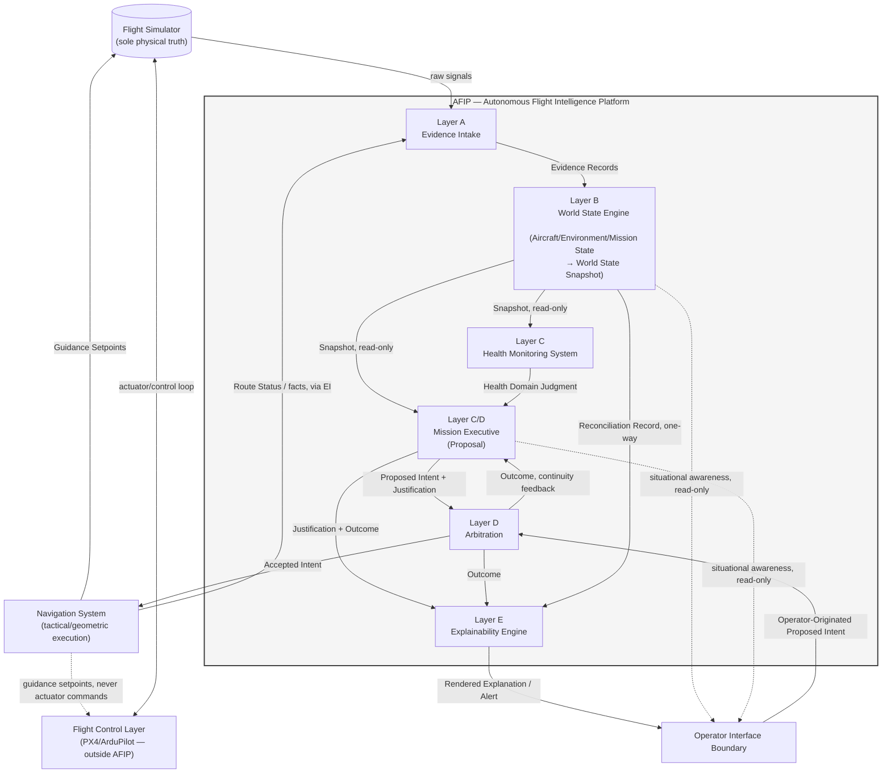

# Autonomous Flight Intelligence Platform (AFIP)
## Complete Architecture Reference

**Document ID:** AFIP-SE-014
**Document Type:** Systems Engineering — Master Architecture Reference
**Status:** Draft v0.1
**Derived From:** AFIP Product Specification v0.2; AFIP Software Architecture v0.1; AFIP World State Engine v0.1; AFIP Mission Executive v0.1; AFIP Navigation System v0.1; AFIP Health Monitoring System v0.1; AFIP Explainability Engine v0.1
**Consolidates:** AFIP-SE-001 through AFIP-SE-013
**Baseline vs. Implementation:** This document is a capstone reference — it introduces no new architectural content beyond what AFIP-SE-001 through AFIP-SE-013 already established. Every section below points to the detailed document that is authoritative for that topic. Implementation Notes already recorded in prior documents (Prediction Engine, Risk Engine, Mission Timeline, Operator Commands) are consolidated once, in Section 9, rather than repeated in full here.
**Scope of this document:** A single, complete, top-to-bottom reference to the entire AFIP architecture as documented — suitable as the one document a new engineer, reviewer, or judge reads first, with pointers into the full document set for depth.

---

## 1. What AFIP Is

The Autonomous Flight Intelligence Platform (AFIP) is a cognitive layer that sits above a PX4/ArduPilot-class flight-control system and a flight simulator (the sole source of physical truth). AFIP does not fly the aircraft and does not simulate it — it reasons about the aircraft's situation, proposes intent, checks that intent against a fixed safety envelope, and explains every decision it makes, in real time, to a human operator (Product Spec §1, §10; Architecture §1).

AFIP is built around five layers, each with a single, non-overlapping responsibility (Architecture §2):

| Layer | Responsibility | Detailed Reference |
|---|---|---|
| A — Evidence Intake | Tag raw signals with source and time; no interpretation | AFIP-SE-001 §4.1 |
| B — World State Engine | Reconcile evidence into confidence-scored belief | AFIP-SE-001 §4.2; AFIP-SE-008 §2–§3 |
| C — Situational Reasoning | Classify domains (Mission Executive, Health Monitoring System) | AFIP-SE-001 §4.3–§4.4 |
| D — Decision & Arbitration | Propose intent, then independently check it | AFIP-SE-001 §4.5–§4.6 |
| E — Explainability & Record | Render explanation, keep permanent record | AFIP-SE-001 §4.10 |

Two systems sit at AFIP's boundary but outside its cognitive core: the **Navigation System** (tactical/geometric execution of AFIP's strategic intent) and the **Operator Interface Boundary** (routes human commands into the same checked path as AFIP's own proposals) (Architecture §3.6; NS §0).

---

## 2. Master Architecture Diagram

This single diagram is the union of AFIP-SE-001 §5, AFIP-SE-003 §2, and AFIP-SE-010 §3 — nothing here appears that was not already established in those documents.

---

## 3. The Two State Machines

AFIP tracks two deliberately independent state machines (AFIP-SE-004), never collapsed into one:

- **Mission Phase State** — a *read* of where the mission stands: PRE-MISSION VALIDATION → ASCENT → TRANSITION (OUT) → CRUISE → TRANSITION (IN) → APPROACH/DESCENT → LANDED/MISSION COMPLETE, with HOLD/DIVERT/RETURN-TO-BASE/ABORT reachable from any state only upon Arbitration-accepted intent (AFIP-SE-004 §2).
- **Executive Posture** — a property of the Mission Executive's own trust in its own reasoning: NOMINAL → CAUTIOUS → MINIMAL → SUSPENDED, downgrading immediately on any qualifying condition and recovering only after a full reasoning cycle confirms the condition has cleared against fresh, confident evidence (AFIP-SE-004 §3).

Full state-by-state entry/exit/transition/safety-constraint detail: **AFIP-SE-004**. Representative reasoning-cycle sequence diagrams for every phase and branch: **AFIP-SE-005**.

---

## 4. The Data and Object Model

Every fact AFIP holds is a **Belief Field** — Value, Confidence, Freshness, Provenance, inseparable (WSE §3.2) — composing three World State objects (Aircraft State, Environment State, Mission State) published together as one atomic **World State Snapshot** (WSE §3.6). Layer C, D, and E each produce their own downstream objects (Health Domain Judgment; Proposed Intent + Justification; Arbitration Outcome; Accepted Intent; Rendered Explanation), none of which is ever written back into the WSE.

Full object catalog with every field: **AFIP-SE-008**. Full interface-by-interface contract (producer, consumer, cadence, ownership, confidence propagation, failure behavior): **AFIP-SE-003**.

---

## 5. Confidence Discipline

Confidence is created exactly once — at the World State Engine — and only ever inherited or aggregated by fixed rule from that point forward: weakest-link at the Mission Executive (ME §7.2), weighted-composite-with-ceiling-rule at the Health Monitoring System (HMS §7.1), and presented without re-derivation at the Explainability Engine (XE §6). Confidence degrades immediately on a qualifying condition and recovers only after a full reasoning cycle confirms genuine clearance against fresh evidence — never from the mere absence of new bad evidence (ME §7.5).

Full derivation chain, per-layer aggregation rules, and recovery discipline: **AFIP-SE-011**.

---

## 6. Failure Handling

The single governing rule across every layer: **a fault results in AFIP asking for less trust, never in AFIP acting harder to compensate** (Architecture §7). This applies uniformly whether the fault occurs in evidence delivery, WSE reconciliation, HMS aggregation, the Mission Executive's proposal function, Arbitration itself, Navigation System planning, or Explainability Engine rendering — each has a specified, non-compensatory response (fail-closed Arbitration; SUSPENDED posture + minimal safe proposal; hold-last-known-good Navigation guidance; explicit gap-rendering rather than fabrication in the XE).

Full per-layer failure mode matrix: **AFIP-SE-006**.

---

## 7. Timing

Belief updates are either continuous (at a rate matched to physical volatility) or event-driven (WSE §5.2) — never ambiguously both. The World State Snapshot publishes on a bounded, regular cycle deliberately decoupled from internal reconciliation speed, so Layer C never observes a half-reconciled world (WSE §5.1). Escalation is always immediate; recovery is always gated on a full, evidence-confirmed cycle (Section 5 above; ME §1.2).

Full cadence table and rationale per data category: **AFIP-SE-007**.

---

## 8. Explainability and Traceability

Every decision — Continue, Adjust, Hold, Divert, Return-to-Base, or Abort, whether Accepted, Modified, or Rejected — produces a contemporaneous, non-reconstructed explanation and permanent record (Architecture P6). A fixed template set (Return Home, Emergency Landing, Mission Abort, Mission Completed) covers the named off-nominal and nominal-completion cases; all other proposals render through standard Decision Summary/Reasoning/Confidence/Evidence/Alternatives/Operator-Messages fields (XE §4, §7). Alert tier (Information/Warning/Critical/Emergency) is derived deterministically from proposal category and Arbitration outcome — never from a discretionary read of operator workload, and never demoted for a qualifying Critical/Emergency condition (XE §8).

Full decision-to-explanation traceability matrix, including a worked example: **AFIP-SE-009**.

---

## 9. Implementation-Phase Naming (Consolidated)

Four functions specified in the baseline are, in the current implementation phase, worked under different names. Each is a **realization of an existing baseline function**, not a new module, new authority, or new interface — consolidated once here from where each was first introduced:

| Implementation-Phase Name | Baseline Function It Realizes | First Documented |
|---|---|---|
| Prediction Engine | HMS §8's six deterministic failure-projection models | AFIP-SE-002 §3.4 |
| Risk Engine | Mission Executive §5's risk assessment (safety/mission/compounded) | AFIP-SE-002 §3.3 |
| Mission Timeline | Explainability Engine §9's Snapshot/Mission-Phase anchoring function | AFIP-SE-002 §3.8 |
| Operator Commands | Architecture §3.6's Operator Interface Boundary | AFIP-SE-002 §3.9 |

None of these four names changes any Producer, Consumer, Ownership, Data Contract, Confidence Propagation, or Failure Behavior field established anywhere in this document set (AFIP-SE-003 preamble).

---

## 10. Requirements and Verification

Thirty-six requirements have been derived directly from the baseline's own binding statements ("must," "never," "always," "sole," "only") and traced to the design element that satisfies each and the verification method appropriate to it (Inspection, Analysis, Demonstration, or Test).

Full Requirements Traceability Matrix: **AFIP-SE-013**.

---

## 11. Constraints, Assumptions, and Reference-Material Boundary

AFIP's architectural constraints (no-skip layering, single-writer discipline, fail-closed Arbitration, deterministic-only safety path, no mission self-redefinition, and others) are non-negotiable by definition — they define what AFIP is. Separately, a small set of airframe- and environment-specific assumptions (dual-rotor ducted-fan tilt-rotor configuration; hover/transition thermal loading; cruise-phase energy dominance; cruise-phase aerodynamic penalties) inform HMS weighting and Mission Executive risk association without themselves being architectural rules.

Four supporting reference documents (an industry-pattern blueprint, a CFD aerodynamic report, a general-purpose information-centric architecture reference, and a CAD model) informed this documentation set's framing but are explicitly **not** part of AFIP's baseline and are never treated as authoritative over the seven core AFIP specifications.

Full constraints/assumptions register and reference-material boundary: **AFIP-SE-012**.

---

## 12. Complete Document Map

| Document | Title | One-Line Purpose |
|---|---|---|
| AFIP-SE-001 | Complete System Data Flow Document | Who produces/consumes what, and in which direction, across all 12 primary interfaces |
| AFIP-SE-002 | AFIP Event Flow Specification | Every discrete, triggerable event and its escalation/propagation rules |
| AFIP-SE-003 | Interface Control Document (ICD) | Formal producer/consumer/cadence/ownership/confidence/failure spec for 15 interfaces |
| AFIP-SE-004 | State Machine Specification | Mission Phase State and Executive Posture, fully specified per state |
| AFIP-SE-005 | Sequence Diagrams | One canonical cycle + 11 phase/branch-specific reasoning-cycle diagrams |
| AFIP-SE-006 | Failure Mode and Recovery Matrix | Per-layer FMEA-style fault, detection, effect, and recovery reference |
| AFIP-SE-007 | Timing & Update Frequency Specification | Every cadence rule and its rationale, consolidated |
| AFIP-SE-008 | Data Dictionary & World State Reference | Every object and field in AFIP, by owning layer |
| AFIP-SE-009 | Explainability Traceability Matrix | Every decision category mapped to its required justification, template, and alert tier |
| AFIP-SE-010 | Module Dependency & Ownership Matrix | Every module's write ownership, read dependencies, and explicit exclusions |
| AFIP-SE-011 | Confidence Propagation Specification | The complete confidence creation/aggregation/decay/recovery chain |
| AFIP-SE-012 | System Constraints & Assumptions | Non-negotiable constraints vs. airframe-specific assumptions vs. reference material |
| AFIP-SE-013 | Requirements Traceability Matrix | 36 derived requirements, each traced to source and verification method |
| AFIP-SE-014 | Complete Architecture Reference (this document) | The single top-level entry point into the full set |

---

## 13. Closing Traceability Statement

Nothing in this fourteen-document set introduces a module, object, interface, state, or authority beyond what the seven core AFIP specifications (Product Specification, Software Architecture, World State Engine, Mission Executive, Navigation System, Health Monitoring System, Explainability Engine) already establish. Every Implementation Note across the set marks a naming realization, never an architectural change. Every open item flagged (ASCENT/APPROACH-DESCENT fault classification; SUSPENDED recovery target posture; numeric timing/latency values) is carried forward as unresolved, consistent with the practice already established in the source documents' own Open Items sections, and is not silently resolved anywhere in this set.

---

**End of Document 14 — AFIP Complete Architecture Reference**

**End of AFIP Systems Engineering Documentation Set (AFIP-SE-001 through AFIP-SE-014)**
